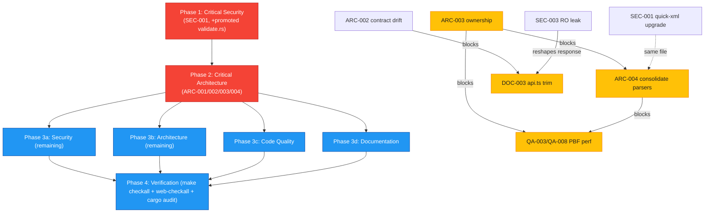

# Project Audit Report

> **Project**: osm-world — 3D city renderer using OpenStreetMap data and WGPU
> **Date**: 2026-07-19
> **Stack**: Rust (edition 2024, workspace: `osm-world` binary + `par-osm-rust` library crate), WGSL shaders, TypeScript / Next.js 16 + React 19 + OpenLayers (bun)
> **Audited by**: Claude Code Audit System (four parallel expert agents — Architecture, Security, Code Quality, Documentation)
> **Scope note**: par-mem (code-memory MCP) was offline during this audit; agents used Glob/Grep/Read/Bash instead of graph analytics. Findings are therefore text/AST-based.

---

## Executive Summary

`osm-world` is a well-engineered project punching above its 0.1.0 weight: clean module layout, genuinely strong server-side input validation, correct async discipline (`spawn_blocking` everywhere), a clippy-clean Rust tree under `-D warnings`, zero `TODO`/`FIXME`/`HACK` debt, and an unusually thorough `docs/ARCHITECTURE.md`. The health is dragged down by a cluster of **infrastructure/contract problems rather than correctness bugs**: a known-vulnerable XML parser (`quick-xml` 0.39.4, two active HIGH DoS CVEs), a `Cargo.lock` that is gitignored despite the workspace shipping a binary, a "shared" `par-osm-rust` crate that is physically duplicated across two repos with no sync, and a Rust↔TypeScript API contract that has silently drifted so two user-visible web features display nonsense. The single highest-leverage decision is resolving the `par-osm-rust` ownership question (vendor vs. git-dep vs. submodule) — several other findings (duplicated OSM/elevation parsers, missing crate README, workspace-deps drift) dissolve once that is decided. Estimated effort to clear the six criticals: ~2–4 focused days.

### Issue Count by Severity

| Severity | Architecture | Security | Code Quality | Documentation | Total |
|----------|:-----------:|:--------:|:------------:|:-------------:|:-----:|
| 🔴 Critical | 3 | 1 | 0 | 2 | **6** |
| 🟠 High     | 4 | 0 | 3 | 3 | **10** |
| 🟡 Medium   | 7 | 4 | 4 | 5 | **20** |
| 🔵 Low      | 4 | 5 | 5 | 5 | **19** |
| **Total**   | **18** | **10** | **12** | **15** | **55** |

> Note: ARC-013 (web `lint` = `next build`) and QA-002 describe the same defect and are counted once in the cross-domain total above (55 unique issues). The per-domain columns retain each domain's own finding for traceability.

---

## 🔴 Critical Issues (Resolve Immediately)

### [SEC-001] Vulnerable `quick-xml` 0.39.4 — two active HIGH-severity DoS CVEs
- **Area**: Security
- **Location**: `Cargo.toml:38`, `crates/par-osm-rust/Cargo.toml:18`; consuming parser at `crates/par-osm-rust/src/osm.rs:380,539` (`quick_xml::Reader::from_str`)
- **Description**: `cargo audit` reports two unfixed advisories on the pinned `quick-xml 0.39.4`:
  - **RUSTSEC-2026-0195** — unbounded namespace-declaration allocation in `NsReader` (CVSS 7.5, memory-exhaustion DoS).
  - **RUSTSEC-2026-0194** — quadratic runtime checking a start tag for duplicate attribute names (CVSS 7.5). Applies to the basic `Reader` actually used here.
  The parser consumes Overpass XML fetched over the network and cached on disk, and also parses any `.osm` path the user supplies.
- **Impact**: A malicious/compromised Overpass mirror (one approved mirror, `overpass.openstreetmap.ru`, is on the allowlist) or a planted cache file can hang the `spawn_blocking` thread, saturate the Tokio pool as requests pile up, and exhaust memory.
- **Remedy**: Upgrade `quick-xml` to `>=0.41.0` in both `Cargo.toml` files (`cargo update -p quick-xml && cargo check`), then add `cargo audit` to CI and to `make pre-commit`.

### [ARC-001] `Cargo.lock` is gitignored for a binary workspace
- **Area**: Architecture
- **Location**: `.gitignore:15`, `Cargo.toml:1-11`
- **Description**: The workspace ships a binary (`osm-world`), so Cargo's guidance is to commit the lockfile for reproducible builds. It is present on disk (136 KB) but untracked. (The separate standalone `par-osm-rust` *library* repo should keep its lockfile untracked — the policy is per-workspace.)
- **Impact**: `cargo build` on a different machine or in CI can resolve to a different transitive graph. WGPU/axum/egui/tokio are high-churn; a patch release can change behavior. Two people debugging the same commit may be running different binaries.
- **Remedy**: Remove the `Cargo.lock` line from `.gitignore` and `git add Cargo.lock`.

### [ARC-002] Rust↔TypeScript API contract drift on `/health` and `/renderer/launch`
- **Area**: Architecture
- **Location**: `web/src/lib/api.ts:94-101,119-121` vs `src/server/types.rs:180-184,220-224`; `src/server/routes.rs:92-94`; consumed at `web/src/app/page.tsx:572,605,609`
- **Description**: TS `LaunchRendererResponse` declares `{ status, pid, program, args, command, command_cwd }`, but Rust only serializes `{ status: "launched" }`. TS `fetchHealth()` declares `{ status, overpass_cache_dir, srtm_cache_dir }`, but Rust returns only `{ status: "ok" }`. The web UI consumes these ghost fields: `page.tsx:572` renders `"Renderer launched as pid ${result.pid}."` (always `undefined`) and `page.tsx:605-609` reads `health?.overpass_cache_dir` / `srtm_cache_dir` (always `undefined`, falling through to the literal `'unavailable'`). `CHANGELOG.md` records these fields were deliberately removed as a security hardening; the TS was never updated.
- **Impact**: Two user-visible features lie to the user. `tsconfig strict: true` "protects" fields that do not exist. There is no `ts-rs`/`typeshare`/OpenAPI codegen to prevent recurrence.
- **Remedy**: Either (a) make Rust return the full shapes TS expects (`Child::id()` for pid; `cache::overpass_cache_dir()`/`srtm_cache_dir()` for health), or (b) delete the unused fields from the TS interfaces and consuming JSX. Either way add a contract-generation step so types cannot drift again.

### [ARC-003] `par-osm-rust` source duplicated across two repos with no sync mechanism
- **Area**: Architecture
- **Location**: `crates/par-osm-rust/` (plain tracked files — no `.gitmodules`, no nested `.git`), declared `par-osm-rust = { path = "crates/par-osm-rust" }` at `Cargo.toml:14`; standalone repo `https://github.com/paulrobello/par-osm-rust` exists and its `Cargo.toml` advertises that repository URL
- **Description**: The library is meant to be shared with `osm-to-bedrock` and other projects (per its own `lib.rs` doc and the migration plans under `docs/superpowers/`). But the copy here is neither a submodule nor a git dependency — it is plain tracked files. The same source lives in two repos; edits do not propagate either direction; "canonical" is undefined.
- **Impact**: The library's reason for existing — a single source of truth for OSM/SRTM/cache logic across projects — is silently broken. Bugs fixed in one repo persist in the other with no signal.
- **Remedy**: Pick one. (a) Make `par-osm-rust` a git submodule consumed by both binaries. (b) Publish it (private registry / git tag) and consume via `par-osm-rust = { git = "...", tag = "..." }`, deleting the in-tree copy. (c) If it must be vendored, add a one-way sync script plus a CI check that the copy matches upstream. The current "looks shared but isn't" state is the worst option.

### [DOC-001] README/CONTRIBUTING/troubleshooting instruct users to clone a sibling `par-osm-rust` that is already vendored
- **Area**: Documentation
- **Location**: `README.md:83-89,103,255`; `CONTRIBUTING.md:20`; `docs/troubleshooting.md:15-30`
- **Description**: All three docs tell users to `git clone https://github.com/paulrobello/par-osm-rust` into `../par-osm-rust` before building, and troubleshooting's first build-failure entry is "no matching package named 'par-osm-rust' found" with that clone as the fix. But `Cargo.toml:14` declares `par-osm-rust = { path = "crates/par-osm-rust" }`, the workspace lists `crates/par-osm-rust`, and the source tree exists. `CHANGELOG.md:21` records "Vendored `par-osm-rust` into workspace for independent builds."
- **Impact**: New users run a needless clone step and may be confused when `../par-osm-rust` is ignored. Users hitting an unrelated build error are sent down a wrong diagnostic path.
- **Remedy**: Delete the "Local dependency" subsections and the stale prerequisite/troubleshooting rows; rewrite the troubleshooting entry to reflect that the vendored crate builds as part of `make build`.

### [DOC-002] No LICENSE file at the project root
- **Area**: Documentation
- **Location**: Project root (missing); `README.md:284`; `Cargo.toml:8`
- **Description**: README says "licensed under the MIT License … declared in `Cargo.toml`." `Cargo.toml` sets `license = "MIT"`, but MIT requires the license text to be present alongside the code. No `LICENSE`/`LICENSE.md`/`COPYING` exists at root.
- **Impact**: The MIT license is not actually instantiated; downstream consumers, contributors, and `cargo publish` have no canonical text.
- **Remedy**: Add a `LICENSE` file containing the standard MIT text with the year and "Paul Robello" as copyright holder.

---

## 🟠 High Priority Issues

### [ARC-004] Parallel OSM parsing and SRTM/elevation implementations in binary and library
- **Area**: Architecture
- **Location**: `src/osm/parse.rs` (686 LOC) vs `crates/par-osm-rust/src/osm.rs` (1158 LOC); `src/geo/elevation.rs` vs `crates/par-osm-rust/src/elevation.rs`; `src/geo/srtm.rs` vs `crates/par-osm-rust/src/srtm.rs`
- **Description**: The binary crate re-implements OSM PBF/XML parsing, HGT elevation loading, and SRTM tile downloading despite the library crate existing to own these. The two `elevation.rs` files are near-identical. Two flavors of `OsmData`/`OsmNode`/`OsmWay` exist with the same names but different shapes (the library's node is `Copy` without tags; the binary's carries `tags: HashMap`). A grep for `par_osm_rust::` outside `src/server/` returns zero hits — the renderer doesn't use the library at all; only the server does.
- **Impact**: Textbook DRY/SRP failure the library was created to prevent. Bugs must be fixed twice. `ARCHITECTURE.md` overstates reality when it says "the renderer uses the shared `par-osm-rust` crate."
- **Remedy**: Extend the library to return the tagged-node shape the renderer needs, point `world/loader/source.rs` at `par_osm_rust::osm::parse_osm_file`, then delete `src/osm/parse.rs`, `src/geo/elevation.rs`, and most of `src/geo/srtm.rs`.

### [ARC-005] Web client never sends an Authorization header — unusable when auth is enabled
- **Area**: Architecture
- **Location**: `web/src/lib/api.ts:107-116` (`apiJson` sends no headers); `src/server/validate.rs:23-28,89-115` (auth middleware expects `Bearer <OSM_WORLD_API_TOKEN>`)
- **Description**: The server requires a Bearer token on every mutating endpoint whenever `OSM_WORLD_API_TOKEN` is set. A grep for `Authorization`/`Bearer`/`api_token` across the entire `web/` tree returns zero matches. The client has no path by which a token could reach the server.
- **Impact**: As soon as a user sets `OSM_WORLD_API_TOKEN` (which docs explicitly invite for any non-local exposure), every prepare/launch/delete/rename returns 401 and the UI shows a generic error with no hint at the cause.
- **Remedy**: Add a client auth module reading a token from `localStorage` (entered via a settings dialog) and inject `Authorization: Bearer <token>` through `apiJson`'s `RequestInit`. Teach `errorHints.ts` to recognize 401 and prompt for a token.

### [ARC-006] WGSL shaders use raw magic numbers that must match Rust constants — only a tautology test guards them
- **Area**: Architecture
- **Location**: Constants at `src/mesh.rs:38-50` (`BUILDING=1.0`, `ROAD_LAYERED=2.10`, `ROAD_PATH=2.25`, `WATER=3.0`, `LANDUSE_OVERLAY=4.25`, `POINT_FEATURE=7.0`, …); shader ranges at `shaders/city.wgsl:218-264` (e.g. `abs(feature_type - 7.0) < 0.5`, `feature_type > 2.5 && feature_type < 3.5`); test at `tests/shader_source_test.rs:8` (`assert!(shader.contains("feature_type < 3.5"))`)
- **Description**: The shader discriminates feature kinds by comparing a vertex attribute against float literals with ad-hoc ±0.5/±0.25 slop. Rust defines named constants; WGSL has no import path back. The test only asserts the literal string appears — it does not parse the shader against the Rust constants.
- **Impact**: Renumbering or shifting a feature constant in Rust silently desyncs the shader → wrong fragment coloring at runtime, no compile error, no test failure. The slop ranges can collide invisibly if two constants drift into each other's band.
- **Remedy**: (a) Generate a `features.wgsl` constant block from the Rust values at build time (`build.rs` emitting into `OUT_DIR`) and compare against named WGSL constants. (b) Replace the `contains(...)` string test with a real cross-check that every range endpoint corresponds to a Rust constant ± its documented slop.

### [ARC-007] Shader helper injection uses runtime string-replacement on a placeholder comment
- **Area**: Architecture
- **Location**: `src/render/pipelines.rs:8-23` (`city_shader_source()` does `source.find("// --- Sky color helpers … ---")` then `replace_range`); same pattern at `src/render/sky_pipeline.rs:6-30` for two placeholders
- **Description**: `sky_helpers.wgsl` is concatenated into `city.wgsl`/`sky.wgsl` by locating an exact comment string and overwriting it. If the placeholder comment is reworded, reformatted, or typo'd, `find()` returns `None`, the `if let Some(pos)` block silently does nothing, and the shader compiles without its helpers.
- **Impact**: A one-character change to a comment can disable atmospheric scattering at runtime with no signal. A new contributor won't realize the comment is load-bearing.
- **Remedy**: Concatenate helpers unconditionally at the top (`format!("{helpers}\n{main_shader}")`) and delete the placeholder, or use `naga_oil` for proper `#include`. If keeping the placeholder, `assert!(pos.is_some(), "shader placeholder missing")`.

### [QA-001] `Home` is a React God component
- **Area**: Code Quality
- **Location**: `web/src/app/page.tsx:126` (969 lines for the single component)
- **Description**: One default-exported component holds 28 `useState` hooks plus 6 `useMemo`, 2 `useEffect`, 2 `useCallback`, and ~30 inline handlers spanning bbox selection, spawn-point selection, feature-filter toggles, source controls, elevation/SRTM options, prepared-area CRUD, profile import/export, renderer-option editing, command-variant building, clipboard copy, and launcher status.
- **Impact**: Every state change re-renders the whole tree; effect-dependency mistakes are easy; the file is hard to scan and test in isolation; new features pile in.
- **Remedy**: Extract cohesive slices into custom hooks (`usePreparedAreas`, `useBboxSelection`, `useSpawnPoint`, `useRendererProfile`, `usePrepareFlow`) and child components (`FeatureFilterSection`, `SourceControlsSection`, `PreparedHistoryPanel`). `PreparedOutputSection`/`PreparedHistorySection`/`HelpOverlay` are already separate — extend that pattern.

### [QA-002 / ARC-013] Web `lint` npm script is `next build`, not a linter (cross-domain duplicate)
- **Area**: Code Quality / Architecture
- **Location**: `web/package.json:8-9` (`"lint": "next build"`); no ESLint/Prettier config, no `eslint-config-next` dependency
- **Description**: `bun run lint` invokes `next build`, which type-checks and bundles but does no linting. There is no ESLint config and no `tsc --noEmit` script. `make checkall` / pre-commit only cover Rust.
- **Impact**: ESLint/biome rules never run; style drift, unused imports, hook-dependency issues, and React anti-patterns ship unchallenged. The misleading script name suggests checking that isn't happening.
- **Remedy**: Switch to `next lint` (or `eslint .`), add a separate `typecheck` script (`tsc --noEmit`), add a `make web-checkall` target (`cd web && bun run lint && bun test`), and wire it into `.pre-commit-config.yaml` as a local hook on `web/**`.

### [QA-003] Unnecessary `tags.clone()` / `node_refs.clone()` in PBF/XML hot path
- **Area**: Code Quality (performance)
- **Location**: `src/osm/parse.rs:197-198,394,506-507,521`; `crates/par-osm-rust/src/osm.rs:240,248,277,285,300-301`
- **Description**: The Way branch builds `OsmWay { tags: tags.clone(), node_refs: node_refs.clone() }` even though neither local is read again, forcing a deep `HashMap` clone plus a `Vec` clone per way. On a metro-scale PBF (millions of ways) this is a real allocation/CPU hit.
- **Impact**: Measurable parse slowdown on large PBF inputs; pure waste.
- **Remedy**: Move both locals into the struct (no clone). Audit each XML `current_*` clone against the loop tail and drop the ones whose source isn't read again. (Coordinate with ARC-004 — see Blocking Relationships.)

### [DOC-003] `web/src/lib/api.ts` documents response fields the server no longer returns
- **Area**: Documentation (the doc half of ARC-002)
- **Location**: `web/src/lib/api.ts:94-101` (`LaunchRendererResponse`), `:119` (`fetchHealth` return type)
- **Description**: `LaunchRendererResponse` declares `pid`, `program`, `args`, `command`, `command_cwd`; `fetchHealth` declares `{ status; overpass_cache_dir; srtm_cache_dir }`. The Rust types return only `{ status: "launched" }` / `{ status: "ok" }` respectively. `docs/ARCHITECTURE.md` is correct on the Rust side; `api.ts` is the stale surface.
- **Impact**: Web developers reading `api.ts` believe the client receives data it does not; code that reads `pid`/`overpass_cache_dir` silently gets `undefined`.
- **Remedy**: Trim the two interfaces to `{ status: string }` (or narrowed types) and update the JSDoc to match `docs/ARCHITECTURE.md`. Pair with a web fixture test asserting the response shape. (Resolve after ARC-002 picks which side wins.)

### [DOC-004] README "Documentation" section omits troubleshooting, CHANGELOG, CONTRIBUTING, and the superpowers index
- **Area**: Documentation
- **Location**: `README.md:222-229`
- **Description**: The Documentation list links Architecture, four superpowers specs, and the style guide — but never `docs/troubleshooting.md`, `CHANGELOG.md`, `CONTRIBUTING.md`, or `docs/superpowers/README.md`. `grep -ni "troubleshooting\|changelog" README.md` returns no hits.
- **Impact**: Users landing on the README never discover the troubleshooting guide; contributors never find the full workflow or the historical spec index.
- **Remedy**: Add four bullets pointing at those files.

### [DOC-005] Docstring gaps on public items in `src/ui/*`, `src/camera/*`, `src/app/*`, and `src/mesh.rs` constants
- **Area**: Documentation
- **Location**: `src/ui/{poi_labels,search,inspect,settings,minimap,hud,mod}.rs`; `src/mesh.rs:38-50` (the 13 `pub const` feature-type discriminants: `TERRAIN`, `BUILDING`, `ROAD`, `WATER`, `LANDUSE`, `RAILWAY`, `POINT_FEATURE`, `STREET_SIGN`, …); `src/camera/{controller,mod}.rs`; `src/app/prefs.rs`
- **Description**: `CONTRIBUTING.md:50-52` mandates `///` docs on public functions/structs/enums and `//!` module docs per file, and the PR checklist requires new public functions to have `///` docs. An AST-aware scan found dozens of undocumented `pub` items in UI/camera/app modules plus all 13 feature-type constants in `mesh.rs`. By contrast `src/server/types.rs`, `mesh.rs::Vertex`, `visual_detail.rs`, and both `lib.rs` files are well-documented.
- **Impact**: The `mesh.rs` constants drive render-layer splitting and shadow-caster selection (per `ARCHITECTURE.md:556-557`) but a contributor cannot tell what the magic numbers mean or which integer slots are reserved. UI module pub items form the surface `app` consumes but lack contract docs.
- **Remedy**: Add `///` docs to the listed items. For `mesh.rs` constants, one doc block per cluster plus per-constant one-liners suffices.

---

## 🟡 Medium Priority Issues

### Architecture
- **[ARC-008] `par-osm-rust` is missing README, CHANGELOG, and `tests/` despite being the shared cross-repo library** — `crates/par-osm-rust/` has only `Cargo.toml` and `src/`. All library tests live in the binary's `src/server/tests.rs`. Add a `README.md` mirroring `lib.rs`, a `CHANGELOG.md` stub, and a `tests/` dir with the source-merge/elevation tests.
- **[ARC-009] No `[workspace.dependencies]` or `[workspace.lints]`** — the two crates share 11 dependencies declared independently (`Cargo.toml:13-41` vs `crates/par-osm-rust/Cargo.toml:11-25`), some pinned in both (`osmpbf 0.3.8`, `quick-xml 0.39.4`) and some floating (`anyhow 1.0`). A `cargo update` can desync them. Promote shared deps to `[workspace.dependencies]` and add `[workspace.lints.clippy]`.
- **[ARC-010] CORS allowlist hardcoded to a single dev port** — `src/server/routes.rs:65-68` hardcodes `http://localhost:8032` and `http://127.0.0.1:8032`; the web port is also hardcoded at `web/package.json:5`. Changing one without the other breaks every API call; no env override; can't run two checkouts concurrently. Read both from env with defaults.
- **[ARC-011] Tests mutate process env via `unsafe { std::env::set_var }`** — `src/server/tests.rs:40-49` uses a custom `EnvRestore` + static `ENV_MUTEX`. The safety argument lives in comments. Where possible, refactor production code to take cache roots as parameters; extract the mutex helper into `mod test_support` with a documented contract.
- **[ARC-012] Several god-object files** — `src/world/road/mod.rs` (1682 LOC: profiles, ribbons, markings, caps, centerlines, crossings), `src/world/point_feature.rs` (1385 LOC: trees, landmarks, nature, POIs, transit), `web/src/app/page.tsx` (1094 LOC), `src/world/loader/mesh.rs` (960 LOC). Split per feature area (`road/{marking,cap,centerline}.rs`; `point_feature/{tree,landmark,nature,poi,transit}.rs`).
- **[ARC-013] Web `lint` is `next build`, no ESLint/Prettier** — see QA-002 (cross-domain duplicate).
- **[ARC-016] Test-scene code ships in production init; triple `append_box`** — `src/render/buffers.rs:67-71,264-393` (`SceneBuffers::new` calls `generate_test_scene` when no `--input`); three separate `append_box` impls (`render/buffers.rs:324`, `world/road/mod.rs:731`, `world/point_feature.rs:727`) with overlapping-but-divergent behavior. Gate the test scene behind `#[cfg(any(test, feature = "dev_scene"))]`; consolidate `append_box` into one place.

### Security
- **[SEC-002] Rate-limit bypass via spoofable client headers** — `src/server/validate.rs:477-484` keys the bucket on `X-Real-IP`/`X-Forwarded-For` (client-controlled), falling back to literal `"unknown"`. Header rotation → unlimited requests; all headerless callers collide into one bucket (one abuser locks out everyone). No eviction → unbounded `HashMap` growth. Derive the key from the socket peer (`ConnectInfo<SocketAddr>`); trust `X-Forwarded-For` only behind an explicit trusted-proxy flag; evict stale buckets.
- **[SEC-003] Filesystem-path disclosure via unauthenticated read-only endpoints** — `src/server/routes.rs:43-46` places `GET /areas/prepared` and `GET /cache/areas` on the unauth router; `PreparedAreaEntry` (`src/server/types.rs:101-123`) serializes `osm_path`, `srtm_dir`, `command_cwd`, `command_program`, `command_args` — i.e. the local username and project root. Local-only by default, but `--host 0.0.0.0` exposes them to any network caller. Require auth on `GET /areas/prepared`, or strip those fields from the public response.
- **[SEC-004] CLI permits binding the API to `0.0.0.0`, voiding the localhost threat model** — `src/main.rs:118-124` accepts any host string (a test at `:448` asserts `0.0.0.0` is allowed). Several mitigations (no-token-means-allow auth, `"unknown"` rate-limit bucket, RO leakage) are conditioned on localhost. An operator binding `0.0.0.0` without `OSM_WORLD_API_TOKEN` exposes an unauthenticated remote API that can `POST /renderer/launch`. Refuse non-loopback hosts unless a token is set (or require `--allow-remote-host`).
- **[SEC-005] Renderer-launch inputs (`osm_path`, `srtm_dir`) accept any filesystem path** — `src/server/shell.rs:41-83` only checks `osm_path` ends in `.osm`; `srtm_dir` unchecked. Args go through `Command::new().args()` (no shell → no injection), but a caller gets a file-existence oracle and can steer the renderer at OS/other-user `.osm` files. Require `osm_path`/`srtm_dir` canonicalize inside `prepared_area_dir()`/`srtm_cache_dir()` with a prefix check; reject escaping symlinks.

### Code Quality
- **[QA-004] `cascade_blend_distance` contains dead computation** — `shaders/city.wgsl:95-97`: `return shadow.shadow_params.y + f32(cascade_index) * 0.0;` makes `cascade_index` meaningless and the function degenerates to returning `shadow.shadow_params.y` for every cascade. Either a never-wired placeholder or silently-broken per-cascade blending. Inline the constant or implement the blend with a shader test.
- **[QA-005] `SceneUniforms` duplicated between `city.wgsl` and `sky.wgsl`** — `shaders/city.wgsl:5-35` and `shaders/sky.wgsl:5-30` hand-copy the struct (with manual `_pad0`..`_pad7`). Editing one and not the other → silent GPU-uniform-layout drift. Extract a `scene_uniforms.wgsl` snippet prepended to both via the existing compile-time concat, or document the invariant in a header.
- **[QA-006] `points.last().unwrap()` reachable on contract violation** — `src/world/road/mod.rs:350` (`interpolate_path_sample`); the function assumes non-empty inputs but the contract is implicit. Add `debug_assert!(!points.is_empty() && …)` or early-return on empty.
- **[QA-007] Large files mixing generation + tests + tag mapping** — `src/world/road/mod.rs` (1682), `src/world/loader/tests.rs` (1638, pure tests — fine), `crates/par-osm-rust/src/overture.rs` (1483), `src/world/point_feature.rs` (1385), `crates/par-osm-rust/src/osm.rs` (1158). Peel test modules into sibling `tests.rs`; split `road/mod.rs` into `profile.rs`/`mesh.rs`/`centerline.rs`/`bridge.rs`. (Overlaps ARC-012.)

### Documentation
- **[DOC-006] Historical specs/plans lack per-file archival markers** — `docs/superpowers/{specs,plans}/*.md` (29 files, 2026-05-01 .. 2026-05-06). The "historical" disclaimer lives only in `docs/superpowers/README.md`; a reader landing directly on a spec sees no warning. Add a one-line callout at the top of each file.
- **[DOC-007] `docs/ARCHITECTURE.md` doesn't enumerate the three `cache_status` values** — `:350-368` shows only `"prepared"`, but `routes.rs:230-280` emits `"prepared"`, `"prepared_cache_hit"`, `"force_refreshed"`. Document all three.
- **[DOC-008] README "Common renderer options" omits many CLI flags** — `README.md:153-165` covers 12 of ~35 flags in `src/main.rs`. Missing: `--cam-*`, `--debug-shadow-cascades`, `--landmark-detail`, `--facade-variation`, `--roof-variation`, `--vegetation-density`, `--synthetic-tree-cap`, `--vegetation-distance`, `--max-uploaded-tiles/--max-uploaded-mb`. Expand or link to the visual-detail spec.
- **[DOC-009] README prerequisites omit Bun/Rust versions and the `run-app` macOS path** — `:99-103` says "Use the toolchain specified by `Cargo.toml`" without naming 1.92; Bun has no version; Quick Start shows `make run` but not `make run-app`, which is the only launch path that gets keyboard focus on macOS/tmux.
- **[DOC-010] Web frontend components have zero JSDoc** — `web/src/app/page.tsx` (1094), `layout.tsx`, `components/{MapPicker,HelpOverlay,PreparedOutputSection,PreparedHistorySection}.tsx`. `lib/*.ts` is well-documented (matching a CHANGELOG claim), but components/app are not. Add a short JSDoc header to each.

---

## 🔵 Low Priority / Improvements

### Architecture
- **[ARC-014] Makefile embeds maintainer-specific absolute paths** — `Makefile:1-8` (`run-sacramento`/`run-woodland`/`run-woodland-last` reference `/Users/probello/...` and specific cache hashes). Move to a gitignored `Makefile.local` (`-include Makefile.local`) or parameterize with env vars.
- **[ARC-015] No `make checkall` equivalent for the web tree** — `checkall` (`Makefile:89`) is Rust-only. Add `web-checkall` and wire into pre-commit.
- **[ARC-017] Root crate is both a binary and a library** — `src/lib.rs:8-19` exposes every module as a public API with no external consumers. Acceptable for bin/test sharing; optionally gate with `#[doc(hidden)]` or document the surface as internal.
- **[ARC-018] `stream` module is a boundary without runtime behavior** — `src/stream/mod.rs:1-5` only re-exports types (runtime incremental upload not yet implemented, per `ARCHITECTURE.md`). Forward-looking; add a `// TODO(phase-X)` reference to the relevant spec.

### Security
- **[SEC-006] Auth-token comparison not constant-time** — `src/server/validate.rs:104` (`token == expected`) short-circuits on first byte. Use `subtle::ConstantTimeEq` or XOR-reduce.
- **[SEC-007] `extra_args` allowlist validates flag names but not values** — `src/server/validate.rs:33-85` accepts any string for `--screenshot <path>`, `--max-uploaded-tiles <n>`, etc. A caller can write a screenshot to an arbitrary path (PNG bytes, not attacker-chosen). Range/paths-check path- and numeric-valued flags.
- **[SEC-008] Unmaintained / unsound transitive deps** — `Cargo.lock`: `memmap2 0.5.10` (unsound, RUSTSEC-2026-0186, pulled transitively by `osmpbf 0.3.8`), `ttf-parser`/`paste` (unmaintained, via egui). Update `osmpbf`/egui when possible; track `cargo audit` in CI.
- **[SEC-009] `Mutex::lock().unwrap()` on the rate limiter can poison** — `src/server/validate.rs:440`. Use `.unwrap_or_else(|e| e.into_inner())` or `parking_lot::Mutex` (no poisoning).
- **[SEC-010] Read-only routes are not rate-limited** — `src/server/routes.rs:43-46`; only the `mutating` router has the layer. `GET /cache/areas` does a `spawn_blocking` directory scan per call. Move the rate-limit layer to the merged router.

### Code Quality
- **[QA-008] Sequential PBF element reading leaves performance on the table** — `src/osm/parse.rs:163`, `crates/par-osm-rust/src/osm.rs:218` use `ElementReader::for_each`; `osmpbf` offers parallel iteration. Worth measuring before committing.
- **[QA-009] Magic thresholds in `get_material` undocumented** — `shaders/city.wgsl:75-93` `0.5, 1.5, 2.5…` ladder maps to `mesh.rs::feature` constants but isn't cross-referenced. Add a comment.
- **[QA-010] `generate_road_with_elevations_and_feature_type` clones its args** — `src/world/road/mod.rs:402-403`. Minor vs. the mesh work that follows; leave.
- **[QA-011] `MAX_BBOX_SPAN_DEGREES = 0.5` / `MAX_BBOX_AREA_DEGREES = 0.10` undocumented** — `src/server/validate.rs:13-16`. Add a one-line comment ("roughly 55 km at the equator").
- **[QA-012] Low test coverage of orchestration paths** — `src/app/render_loop.rs` (500), `src/app/init.rs` (786), `src/ui/{poi_labels,minimap,inspect,settings}.rs`, `src/render/buffers.rs` (504) have few/no integration tests; WGSL tests are substring-based not rendering-output; no end-to-end "prepare → launch → screenshot" CI flow.

### Documentation
- **[DOC-011] `AGENTS.md` is 16 bytes** (`read @CLAUDE.md`) — fine if an intentional redirect; otherwise flesh out or remove.
- **[DOC-012] No CI badge in README** — `.github/workflows/ci.yml` runs fmt+typecheck+lint+test on ubuntu-latest with Rust 1.92. Add the standard `actions/workflows/ci.yml/badge.svg`.
- **[DOC-013] README "Version 0.1.0" badge is hardcoded** — will drift on release. Drop it or accept the maintenance cost (style guide warns about duplicated versions).
- **[DOC-014] `ideas.md` graphify item is stale** — line 49 still lists "Graphify-backed architecture docs" after commit `2a8bfb4` removed graphify. Per `ideas.md:6` ("Remove completed items"), remove it.
- **[DOC-015] `docs/troubleshooting.md` lacks WGPU-init and `bun install` failure entries** — covers build/GPU/scene/ports/auth/web/Overpass/SRTM/cache well; add Linux X11/Wayland WGPU-surface failures and `bun install` permission/peer-dep failures.

---

## Detailed Findings

### Architecture & Design
Overall health **Fair**. Clean module layout, strong server-side validation, and good state decomposition (`App` split into `AppUiState`/`AppRenderState`/`AppViewState`), undermined by a contract-drifted web client, a "shared" library that duplicates its own consumers, and an untracked `Cargo.lock`. Layer-specific index buffers in `SceneBuffers` (split into `terrain`/`landuse`/`water`/`road_path`/`road`/`railway`/`road_marking`/`solids` from one vertex buffer, driven by an exhaustive `FeatureLayer::from_f32` match) and the shadow index filtering to building triangles only are particularly clean pieces of design. The single highest-leverage decision is ARC-003 (resolve `par-osm-rust` ownership); ARC-004, ARC-008, and ARC-009 all flow from it.

### Security Assessment
Overall posture **Fair**. Strong input-validation and SSRF posture for a local-first tool; pulled down by the known-vulnerable XML parser and by auth/rate-limit gaps that activate as soon as an operator binds to anything other than loopback. Verified positives: SSRF Overpass allowlist requires HTTPS, rejects userinfo, matches a five-host allowlist with unit tests covering AWS-metadata IP / RFC-1918 / userinfo trick; default bind is `127.0.0.1`; CORS is locked to two local origins (not `*`); cache-key validation requires exactly 64 lowercase-hex chars (no `..`/separator reach); spawn uses `argv` never a shell; TLS verification never disabled; SRTM URL built from signed integers only; atomic file writes everywhere cache files land; pre-commit secret scanning (`gitleaks` + `detect-private-key`) wired; `ApiError` returns generic `client_message` with details logged server-side only; zero hardcoded credentials / `dangerouslySetInnerHTML` / `eval` in `web/src`. Highest risk: the pinned `quick-xml` parsing externally-sourced XML against the `spawn_blocking` pool.

### Code Quality
Overall health **Good**. Clippy clean under `-D warnings`; zero `TODO`/`FIXME`/`HACK`/`XXX` in production (2 `panic!` calls in `crates/par-osm-rust/src/sources.rs` test code used as "must-not-execute" assertions — appropriate); only ~6 `unwrap`/`expect` across all of `src/`, each individually defensible. 47 inline `#[cfg(test)]` modules with 390 `#[test]` functions (~60–70% coverage), meaningfully named. Web client fully typed (zero `any`/`as any`/`dangerouslySetInnerHTML`); each `lib/*.ts` ships a paired `.test.ts`. Primary liabilities: the 969-line `Home` component (QA-001), the cosmetic-but-real `lint`-is-actually-`build` bug (QA-002), the PBF hot-path clones (QA-003), and a handful of oversized generation files. Untested: UI/render orchestration wiring, buffer layout beyond 1–2 invariants, and any end-to-end render flow.

### Documentation Review
Overall health **Good**. `docs/ARCHITECTURE.md` is genuinely excellent (full endpoint schemas with field-by-field tables, error-status matrix, request-flow sequence diagram, decision/risk tables, explicit "documentation drift" acknowledgment) and correctly reflects the current vendored-`par-osm-rust` code. The style guide exists, is linked from the README, and is being followed (every fenced block specifies a language; Mermaid uses `classDef`; no brittle line numbers; no shell prompts in copy-paste blocks). `crates/par-osm-rust/src/lib.rs` has an exemplary module docstring with a runnable `no_run` example. All 29 internal markdown links checked resolve; all five WGSL shaders carry top-of-file purpose comments. Biggest problems are staleness (stale `par-osm-rust` clone instructions, drifted `api.ts` types) and an onboarding gap (README never links troubleshooting/CHANGELOG/CONTRIBUTING).

---

## Remediation Roadmap

### Immediate Actions (Before Next Deployment)
1. **[SEC-001]** Upgrade `quick-xml` 0.39.4 → ≥0.41.0; add `cargo audit` to CI/pre-commit.
2. **[ARC-001]** Commit `Cargo.lock` (remove from `.gitignore`).
3. **[DOC-002]** Add the MIT `LICENSE` file.
4. **[ARC-002] / [DOC-003]** Resolve the `/health` + `/renderer/launch` contract drift (pick Rust-returns-fields or TS-trim) and add contract generation so it cannot recur.

### Short-term (Next 1–2 Sprints)
1. **[ARC-003]** Decide `par-osm-rust` ownership (submodule / git-dep / published / vendored+sync) — unblocks ARC-004, ARC-008, ARC-009.
2. **[ARC-004]** Consolidate the duplicated OSM/elevation/SRTM parsers into the library; delete the binary's copies.
3. **[SEC-002..005]** Land the server hardening (peer-IP rate limiting, RO-route auth/gating, non-loopback host guard, path canonicalization).
4. **[ARC-005]** Add client-side auth so the web UI works when `OSM_WORLD_API_TOKEN` is set.
5. **[ARC-006] / [ARC-007]** Generate shader constants from Rust and stop the placeholder string-replace injection.
6. **[DOC-001]** Remove stale `par-osm-rust` clone instructions across README/CONTRIBUTING/troubleshooting.
7. **[QA-002 / ARC-013]** Fix the web `lint` script; add `web-checkall` + pre-commit hook.

### Long-term (Backlog)
1. **[ARC-012] / [QA-001] / [QA-007]** Decompose the god-object files (`road/mod.rs`, `point_feature.rs`, `page.tsx`, `loader/mesh.rs`).
2. **[QA-003] / [QA-008]** PBF hot-path clone removal + measure parallel parsing.
3. **[ARC-016]** Gate the test scene out of production; consolidate the three `append_box` impls.
4. **[ARC-009]** Promote shared deps to `[workspace.dependencies]`; add `[workspace.lints]`.
5. **[DOC-005] / [DOC-010]** Backfill docstrings on UI/camera/mesh constants and JSDoc on web components.
6. **[QA-012]** Grow orchestration/e2e test coverage.

---

## Positive Highlights

1. **Outstanding static-analysis hygiene.** `cargo clippy --all-targets --all-features -- -D warnings` is clean; zero `TODO`/`FIXME`/`HACK` markers; only ~6 defensible `unwrap`/`expect` calls across all of `src/`.
2. **Server-side validation is the strongest part of the codebase.** `server/validate.rs` enforces bbox span *and* area, spawn-must-be-inside-bbox, SRTM tile budget, an allowlist (not regex) of renderer flags, a typed `PrepareAreaError` → HTTP-status map, and a sliding-window rate limiter.
3. **Correct async discipline.** Every filesystem/network call goes through `task::spawn_blocking`; `AppState` is a thin `PathBuf` clone; handlers are pure functions of request + state.
4. **Thoughtful application-state decomposition.** `App` separates `AppUiState`/`AppRenderState`/`AppViewState`, keeping the render-loop borrow story tractable and preventing an `App` god-object.
5. **Clean render-layer design.** Layer-specific index buffers from one vertex buffer, an exhaustive `FeatureLayer::from_f32` match (no float-equality chains), and a building-only shadow index with a documented reason.
6. **Fully typed web client.** Zero `any`/`as any`/`dangerouslySetInnerHTML`; every `lib/*.ts` declares/JSDocs its types and ships a paired test.
7. **Shader correctness is structurally enforced.** `shader_source_test.rs` invokes `naga::front::wgsl::parse_str` so WGSL must actually parse, and reproduces the compile-time `sky_helpers.wgsl` concatenation so the test sees what the renderer sees.
8. **Excellent architecture documentation + style guide that the project actually follows**, plus pre-commit wired correctly to the Makefile targets (`gitleaks` + `detect-private-key` + `make fmt|lint|test` as `language: system` hooks).

---

## Audit Confidence

| Area | Files Reviewed | Confidence |
|------|---------------|-----------|
| Architecture | ~30 (manifests, mod files, server/, render/, world/, web/src/lib) | High |
| Security | server/ crate, validate/shell/types/routes, overpass/srtm, Cargo.lock, web/src | High |
| Code Quality | largest src/ files, server/, osm parsers, shaders, tests, web/src/app + lib | High |
| Documentation | all root docs, docs/, sampled docstrings across src/ + web/src | High |

> par-mem (graph analytics) was unavailable, so all four agents used text/AST-based discovery (Glob/Grep/Read/Bash, including `cargo clippy`, `cargo audit`, and `naga` parse checks). Confidence is High because the agents independently cross-checked claims against source (e.g. ARC-002 confirmed `page.tsx` consumes the ghost fields; SEC-001 confirmed via `cargo audit`; QA-002 confirmed `package.json`).

---

## Remediation Plan

> This section is generated by the audit and consumed directly by `/fix-audit`. It pre-computes phase assignments and file conflicts so the fix orchestrator can proceed without re-analyzing the codebase.

### Phase Assignments

#### Phase 1 — Critical Security (Sequential, Blocking)
<!-- SEC-001 (Critical). Also promotes SEC-002/006/007/009 — all in src/server/validate.rs, which Code Quality (QA-011) also edits, to keep that conflict file out of parallel execution. -->

| ID | Title | File(s) | Severity |
|----|-------|---------|----------|
| SEC-001 | Upgrade `quick-xml` 0.39.4 → ≥0.41.0 (two HIGH DoS CVEs) | `Cargo.toml`, `crates/par-osm-rust/Cargo.toml`, `crates/par-osm-rust/src/osm.rs` | 🔴 Critical |
| SEC-002 | Rate-limit key from socket peer, not spoofable headers; evict stale buckets | `src/server/validate.rs` | 🟡 Medium (promoted — conflict file) |
| SEC-006 | Constant-time auth-token comparison | `src/server/validate.rs` | 🔵 Low (promoted — conflict file) |
| SEC-007 | Validate `extra_args` flag *values* (paths/numerics), not just names | `src/server/validate.rs` | 🔵 Low (promoted — conflict file) |
| SEC-009 | Rate-limiter `Mutex::lock` poisoning recovery | `src/server/validate.rs` | 🔵 Low (promoted — conflict file) |

#### Phase 2 — Critical Architecture (Sequential, Blocking)
<!-- ARC-001/002/003 (Critical). Promotes ARC-004 because it explicitly blocks Code Quality work on the OSM parsers (QA-003/QA-008) and Security's parser-site work (SEC-001). -->

| ID | Title | File(s) | Severity | Blocks |
|----|-------|---------|----------|--------|
| ARC-001 | Commit `Cargo.lock` for the binary workspace | `.gitignore`, `Cargo.lock` | 🔴 Critical | — |
| ARC-002 | Resolve `/health` + `/renderer/launch` contract drift; add contract codegen | `web/src/lib/api.ts`, `src/server/types.rs`, `src/server/routes.rs`, `web/src/app/page.tsx` | 🔴 Critical | DOC-003, QA-001 (drifted-field JSX) |
| ARC-003 | Decide `par-osm-rust` ownership (submodule/git-dep/published/vendored+sync) | `Cargo.toml`, `crates/par-osm-rust/**` | 🔴 Critical | ARC-004, ARC-008, ARC-009, QA-003, QA-008 |
| ARC-004 | Consolidate duplicated OSM/elevation/SRTM parsers into the library | `src/osm/parse.rs`, `src/geo/elevation.rs`, `src/geo/srtm.rs`, `crates/par-osm-rust/src/{osm,elevation,srtm}.rs` | 🟠 High (promoted) | QA-003, QA-008 |

#### Phase 3 — Parallel Execution
<!-- All remaining work, safe to run concurrently by domain. Within a domain, honor the file-conflict map. -->

**3a — Security (remaining)**

| ID | Title | File(s) | Severity |
|----|-------|---------|----------|
| SEC-003 | Auth/gate `GET /areas/prepared` or strip fs-path fields | `src/server/routes.rs`, `src/server/types.rs` | 🟡 Medium |
| SEC-004 | Refuse non-loopback `--host` unless token set / `--allow-remote-host` | `src/main.rs` | 🟡 Medium |
| SEC-005 | Canonicalize + prefix-check `osm_path`/`srtm_dir` to cache roots | `src/server/shell.rs`, `src/server/types.rs` | 🟡 Medium |
| SEC-008 | Track/update unsound transitive deps (`memmap2 0.5`, `ttf-parser`, `paste`) | `Cargo.lock`, `Cargo.toml` | 🔵 Low |
| SEC-010 | Move rate-limit layer to the merged router (cover RO routes) | `src/server/routes.rs` | 🔵 Low |

**3b — Architecture (remaining)**

| ID | Title | File(s) | Severity |
|----|-------|---------|----------|
| ARC-005 | Client-side auth: inject `Authorization: Bearer` + 401 handling | `web/src/lib/api.ts`, `web/src/lib/errorHints.ts` | 🟠 High |
| ARC-006 | Generate `features.wgsl` from Rust constants; real shader↔Rust cross-check test | `src/mesh.rs`, `shaders/city.wgsl`, `tests/shader_source_test.rs`, `build.rs` | 🟠 High |
| ARC-007 | Concatenate shader helpers unconditionally (drop placeholder string-replace) | `src/render/pipelines.rs`, `src/render/sky_pipeline.rs`, `shaders/city.wgsl`, `shaders/sky.wgsl` | 🟠 High |
| ARC-008 | Add `par-osm-rust` README/CHANGELOG/`tests/` | `crates/par-osm-rust/` | 🟡 Medium |
| ARC-009 | Promote shared deps to `[workspace.dependencies]`; add `[workspace.lints]` | `Cargo.toml`, `crates/par-osm-rust/Cargo.toml` | 🟡 Medium |
| ARC-010 | Make CORS origin + web port env-configurable | `src/server/routes.rs`, `web/package.json` | 🟡 Medium |
| ARC-011 | Refactor env-mutating tests off `unsafe set_var` / extract shared helper | `src/server/tests.rs` | 🟡 Medium |
| ARC-012 | Decompose god-object files | `src/world/road/mod.rs`, `src/world/point_feature.rs`, `web/src/app/page.tsx`, `src/world/loader/mesh.rs` | 🟡 Medium |
| ARC-016 | Gate test-scene behind cfg; consolidate the three `append_box` | `src/render/buffers.rs`, `src/app/init.rs` | 🟡 Medium |

**3c — Code Quality (all)**

| ID | Title | File(s) | Severity |
|----|-------|---------|----------|
| QA-001 | Decompose `Home` into hooks + child components | `web/src/app/page.tsx` | 🟠 High |
| QA-002 | Real web `lint` (`next lint`/`eslint`) + `typecheck` + `web-checkall` + pre-commit | `web/package.json`, `Makefile`, `.pre-commit-config.yaml` | 🟠 High |
| QA-003 | Drop `tags.clone()`/`node_refs.clone()` in PBF/XML hot path *(after ARC-004)* | `src/osm/parse.rs`, `crates/par-osm-rust/src/osm.rs` | 🟠 High |
| QA-004 | Fix or implement `cascade_blend_distance` per-cascade blend | `shaders/city.wgsl` | 🟡 Medium |
| QA-005 | Extract shared `SceneUniforms` snippet for both shaders | `shaders/city.wgsl`, `shaders/sky.wgsl` | 🟡 Medium |
| QA-006 | `debug_assert!`/early-return on empty `points` in `interpolate_path_sample` | `src/world/road/mod.rs` | 🟡 Medium |
| QA-007 | Peel test modules into `tests.rs`; split oversized generation files | `src/world/road/mod.rs`, `crates/par-osm-rust/src/overture.rs`, `src/world/point_feature.rs`, `src/world/loader/mesh.rs` | 🟡 Medium |
| QA-008 | Measure/adopt parallel PBF element reading *(after ARC-004)* | `src/osm/parse.rs`, `crates/par-osm-rust/src/osm.rs` | 🔵 Low |
| QA-009 | Document `get_material` magic thresholds (cross-ref `mesh.rs` constants) | `shaders/city.wgsl` | 🔵 Low |
| QA-010 | Drop arg clones in `generate_road_with_elevations_and_feature_type` (optional) | `src/world/road/mod.rs` | 🔵 Low |
| QA-011 | Document `MAX_BBOX_SPAN_DEGREES`/`MAX_BBOX_AREA_DEGREES` *(after Phase 1 validate.rs edits)* | `src/server/validate.rs` | 🔵 Low |
| QA-012 | Grow orchestration/e2e test coverage | `src/app/render_loop.rs`, `src/app/init.rs`, `src/ui/*`, `src/render/buffers.rs` | 🔵 Low |

**3d — Documentation (all)**

| ID | Title | File(s) | Severity |
|----|-------|---------|----------|
| DOC-001 | Remove stale `par-osm-rust` clone instructions | `README.md`, `CONTRIBUTING.md`, `docs/troubleshooting.md` | 🔴 Critical |
| DOC-002 | Add MIT `LICENSE` file | `LICENSE` (new) | 🔴 Critical |
| DOC-003 | Trim `api.ts` response types to match server *(after ARC-002)* | `web/src/lib/api.ts` | 🟠 High |
| DOC-004 | Add troubleshooting/CHANGELOG/CONTRIBUTING/superpowers links to README | `README.md` | 🟠 High |
| DOC-005 | Backfill `///` docs on UI/camera/mesh constants | `src/ui/*`, `src/camera/*`, `src/app/prefs.rs`, `src/mesh.rs` | 🟠 High |
| DOC-006 | Add per-file archival markers to historical specs/plans | `docs/superpowers/{specs,plans}/*.md` | 🟡 Medium |
| DOC-007 | Document all three `cache_status` values | `docs/ARCHITECTURE.md` | 🟡 Medium |
| DOC-008 | Expand README CLI-flags table / link visual-detail spec | `README.md` | 🟡 Medium |
| DOC-009 | Add Rust/Bun versions + `run-app` macOS note to prerequisites | `README.md` | 🟡 Medium |
| DOC-010 | Add JSDoc headers to web components | `web/src/app/page.tsx`, `web/src/app/layout.tsx`, `web/src/components/*.tsx` | 🟡 Medium |
| DOC-011 | Flesh out or remove `AGENTS.md` | `AGENTS.md` | 🔵 Low |
| DOC-012 | Add CI badge to README | `README.md` | 🔵 Low |
| DOC-013 | Drop or maintain hardcoded version badge | `README.md` | 🔵 Low |
| DOC-014 | Remove stale graphify idea | `ideas.md` | 🔵 Low |
| DOC-015 | Add WGPU-init + `bun install` troubleshooting entries | `docs/troubleshooting.md` | 🔵 Low |

### File Conflict Map
<!-- Files touched by issues in multiple domains. Fix agents must read current file state before editing — a prior agent may have already changed these. -->

| File | Domains | Issues | Risk |
|------|---------|--------|------|
| `src/server/validate.rs` | Security + Code Quality | SEC-002, SEC-006, SEC-007, SEC-009, QA-011 | ⚠️ Read before edit (Phase 1 sec edits land before QA-011 in 3c) |
| `crates/par-osm-rust/src/osm.rs` | Security + Architecture + Code Quality | SEC-001, ARC-003, ARC-004, QA-003, QA-008 | ⚠️ Read before edit (Phase 1 → Phase 2 → 3c ordering) |
| `Cargo.toml` | Security + Architecture | SEC-001, ARC-001, ARC-003, ARC-009 | ⚠️ Read before edit |
| `crates/par-osm-rust/Cargo.toml` | Security + Architecture | SEC-001, ARC-003, ARC-009 | ⚠️ Read before edit |
| `web/src/lib/api.ts` | Architecture + Documentation | ARC-002, ARC-005, DOC-003 | ⚠️ Read before edit (ARC-002 in Phase 2 wins, then DOC-003 trims in 3d) |
| `web/src/app/page.tsx` | Architecture + Code Quality + Documentation | ARC-002, ARC-012, QA-001, DOC-010 | ⚠️ Read before edit |
| `src/server/types.rs` | Architecture + Security | ARC-002, SEC-003, SEC-005 | ⚠️ Read before edit |
| `src/server/routes.rs` | Architecture + Security | ARC-002, ARC-010, SEC-003, SEC-010 | ⚠️ Read before edit |
| `shaders/city.wgsl` | Architecture + Code Quality | ARC-006, ARC-007, QA-004, QA-005, QA-009 | ⚠️ Read before edit |
| `src/world/road/mod.rs` | Architecture + Code Quality | ARC-012, QA-006, QA-007, QA-010 | ⚠️ Read before edit |
| `src/world/point_feature.rs` | Architecture + Code Quality | ARC-012, QA-007 | ⚠️ Read before edit |
| `src/world/loader/mesh.rs` | Architecture + Code Quality | ARC-012, QA-007 | ⚠️ Read before edit |
| `src/render/buffers.rs` | Architecture + Code Quality | ARC-016, QA-012 | ⚠️ Read before edit |
| `src/app/init.rs` | Architecture + Code Quality | ARC-016, QA-012 | ⚠️ Read before edit |
| `web/package.json` | Architecture + Code Quality | ARC-013, QA-002 (same fix) | ⚠️ Do once |
| `src/osm/parse.rs` | Architecture + Code Quality | ARC-004, QA-003, QA-008 | ⚠️ Read before edit (likely deleted by ARC-004) |
| `src/mesh.rs` | Architecture + Documentation | ARC-006, DOC-005 | ⚠️ Read before edit |
| `Makefile` | Architecture + Code Quality | ARC-014, ARC-015, QA-002 | ⚠️ Read before edit |
| `src/ui/*.rs` | Documentation + Code Quality | DOC-005, QA-012 | ⚠️ Read before edit |

### Blocking Relationships
<!-- Explicit dependency declarations from audit agents. Format: [blocker] → [blocked] — reason -->

- **ARC-003 → ARC-004, ARC-008, ARC-009, QA-003, QA-008** — the `par-osm-rust` ownership decision determines whether edits land here, upstream, or both; touching the crate before the decision risks wasted work on a copy that gets superseded.
- **ARC-004 → QA-003, QA-008** — the duplicated `src/osm/parse.rs` + `src/geo/elevation.rs` should be *deleted* in favor of the library, not cleaned up; refactoring them first invests in code the consolidation removes.
- **ARC-002 → DOC-003, (QA-001 drifted-field JSX)** — the contract-drift fix picks which side wins; the doc trim and the `page.tsx` JSX that consumes `pid`/`overpass_cache_dir` must follow.
- **SEC-001 → (any work in `crates/par-osm-rust/src/osm.rs`)** — the `quick-xml` 0.39 → 0.41 upgrade trips minor `Reader` API renames and shifts line numbers; sequence other osm.rs work after it.
- **SEC-003 → (frontend/doc work on the prepared-areas response)** — restructuring which router `GET /areas/prepared` lives on (or which fields `PreparedAreaEntry` serializes) changes the response shape `PreparedHistorySection.tsx` / `PreparedOutputSection.tsx` / `api.ts` depend on.
- **SEC-005 → (other `src/server/shell.rs` work)** — the canonicalization + prefix check lands inside `renderer_launch_command`; sequence other shell.rs refactors after it to avoid conflicts in the validation block.
- **Phase 1 (validate.rs security) → QA-011** — both edit `src/server/validate.rs`; the security fixes land first so QA-011's comment additions apply to the post-fix file.

### Dependency Diagram

