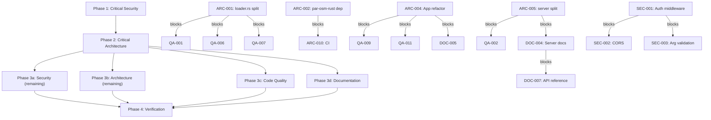

# Project Audit Report

> **Project**: osm-world
> **Date**: 2026-05-09
> **Stack**: Rust (WGPU/WGSL), TypeScript/Next.js, WGSL shaders
> **Audited by**: Claude Code Audit System

---

## Executive Summary

The osm-world project is an ambitious 3D city renderer built on OSM/Overture data with a Rust backend and Next.js web frontend. The codebase shows strong fundamentals: excellent dependency directionality, thorough test coverage in critical modules (282 Rust tests), well-structured render pipeline, and comprehensive architecture documentation. However, two architectural monoliths (`loader.rs` at 3,452 lines and `server.rs` at 2,017 lines) concentrate excessive responsibility, and a critical security vulnerability allows unauthenticated remote process spawning. The most impactful remediation effort is splitting `loader.rs` and adding authentication to the server API — these two changes would address 7 critical/high issues. Estimated effort for top-priority fixes: 2-3 focused sessions.

### Issue Count by Severity

| Severity | Architecture | Security | Code Quality | Documentation | Total |
|----------|:-----------:|:--------:|:------------:|:-------------:|:-----:|
| 🔴 Critical | 2 | 1 | 2 | 2 | **7** |
| 🟠 High     | 4 | 3 | 5 | 4 | **16** |
| 🟡 Medium   | 5 | 4 | 6 | 6 | **21** |
| 🔵 Low      | 4 | 5 | 2 | 6 | **17** |
| **Total**   | **15** | **13** | **15** | **18** | **61** |

---

## 🔴 Critical Issues (Resolve Immediately)

### [SEC-001] Unauthenticated Remote Process Spawn via `/renderer/launch`
- **Area**: Security
- **Location**: `src/server.rs:374-385` (handler), `:737-758` (implementation)
- **Description**: The `/renderer/launch` POST endpoint spawns `cargo run` on the server with zero authentication. Any network client on port 3030 can trigger arbitrary process launches. `extra_args: Vec<String>` is passed directly to cargo with no allowlist — enabling flags like `--config` that can alter build behavior or execute arbitrary commands.
- **Impact**: Any website or local network attacker can silently spawn processes on the host machine. Combined with permissive CORS, a malicious webpage can trigger this via cross-origin request.
- **Remedy**: Add authentication middleware to all mutating endpoints. Validate `extra_args` against an allowlist of known renderer flags. Add rate limiting and max concurrent process count.

### [ARC-001] `loader.rs` is a 3,452-line God Object spanning four distinct responsibilities
- **Area**: Architecture
- **Location**: `src/world/loader.rs`
- **Description**: This single file acts as data model (`WorldSource`, `ResolvedFeature`, `WorldMesh`, `CpuMesh`, `TileMeshSet`), OSM parsing orchestrator, mesh generation pipeline, geometry utilities (`point_in_polygon`, `clip_polygon_to_rect`, `ensure_ccw`), and vegetation placement logic. The top god-node in the graph with 39 edges.
- **Impact**: Any change to data model, parsing, mesh generation, or geometry requires modifying the same massive file. Testing individual concerns requires compiling the entire monolith.
- **Remedy**: Split into `world/loader/source.rs`, `world/loader/mesh.rs`, `world/loader/geometry.rs`, `world/loader/vegetation.rs`. Re-export public API from `world/loader.rs` as a facade.

### [ARC-002] Local path dependency on `par-osm-rust` creates tight coupling to sibling repo
- **Area**: Architecture
- **Location**: `Cargo.toml:11`
- **Description**: `par-osm-rust = { path = "../par-osm-rust" }` binds the build to a specific directory layout. The project cannot be cloned and built independently. Server directly re-exports types from the sibling crate.
- **Impact**: Not buildable in CI or by other developers without also cloning the sibling repo at the correct relative path. Breaking changes in `par-osm-rust` silently compile with no version gate.
- **Remedy**: Vendor `par-osm-rust` into the workspace (e.g., `crates/par-osm-rust`) or publish to a registry and pin a version. Add a Cargo workspace at the repo root.

### [QA-001] `loader.rs` 3,452 lines is the largest file — God Module with 46 inline tests
- **Area**: Code Quality
- **Location**: `src/world/loader.rs`
- **Description**: The file contains data structures, core loading orchestrator (~300 lines), mesh generation, tile indexing, polygon winding normalization, tree area point scattering, and 46 inline test functions (~1,600 lines). The `load_world_source_with_visual_detail` function alone spans 314 lines with deeply nested loops.
- **Impact**: The most coupled module in the codebase (32 edges for both `load_world_source()` and `append_world_mesh()`). Any change to world loading, mesh generation, or feature classification requires editing this monolith.
- **Remedy**: Split into focused modules: `world/source.rs` (data structures), `world/loader.rs` (orchestration), `world/mesh.rs` (mesh generation), `world/tile_index.rs` (tile indexing). Extract the 46 tests into a dedicated test module. *(Partially addressed by ARC-001)*

### [QA-002] `server.rs` is 2,017 lines with an 875-line inline test module
- **Area**: Code Quality
- **Location**: `src/server.rs`
- **Description**: Production API handler logic (data validation, caching, file I/O, command building, response serialization) mixed with 21 inline test functions (lines 1142-2017). The production portion (~1,140 lines) does not decompose into focused modules.
- **Impact**: Any change to API behavior requires navigating a file that also contains all tests. Test helpers are inaccessible from integration tests.
- **Remedy**: Extract tests into `tests/server_test.rs`. Split production code: `server/handlers.rs`, `server/cache.rs`, `server/validation.rs`, `server/launch.rs`. *(Addressed by ARC-005)*

### [DOC-001] No CHANGELOG.md
- **Area**: Documentation
- **Location**: Missing at project root
- **Description**: No CHANGELOG.md or equivalent version history. README badge declares version 0.1.0 but there is no record of what changed. Recent commits show substantive feature additions (layered sun depth shader, day cycle, road visuals, renderer streaming fixes) with no release notes.
- **Impact**: Contributors and users cannot understand what changed between versions or assess upgrade risk.
- **Remedy**: Create `CHANGELOG.md` with an initial entry for 0.1.0 summarizing the current feature set. Follow the style guide's changelog template.

### [DOC-002] Environment variable `OVERPASS_URL` documented but not referenced in codebase
- **Area**: Documentation
- **Location**: `README.md` (Configuration table)
- **Description**: The README lists `OVERPASS_URL` as an environment variable but `grep -rn 'OVERPASS_URL'` finds zero matches in `src/` and `web/src/`. The variable may be consumed by `par-osm-rust`, but this is not stated.
- **Impact**: Users setting `OVERPASS_URL` will see no effect. Factual inaccuracy causing confusion.
- **Remedy**: Either confirm the variable is consumed by `par-osm-rust` and update the description, or remove it from the table.

---

## 🟠 High Priority Issues

### [SEC-002] Permissive CORS Configuration
- **Area**: Security
- **Location**: `src/server.rs:294`
- **Description**: `CorsLayer::permissive()` allows any origin to make cross-origin requests. Combined with the unauthenticated process-spawn endpoint, any website can silently trigger renderer launches.
- **Impact**: Cross-origin attack vector from malicious websites.
- **Remedy**: Replace with explicit allowlist: `AllowOrigin::list([HeaderValue::from_static("http://localhost:8032")])`.

### [SEC-003] Unvalidated `extra_args` Passed to Process Spawn
- **Area**: Security
- **Location**: `src/server.rs:792`
- **Description**: `req.extra_args` cloned directly into `cargo run` arguments with no validation. Cargo flags like `--config` can alter build behavior or execute arbitrary commands.
- **Impact**: Argument injection enabling command execution via cargo's config system.
- **Remedy**: Validate each element against an allowlist of known renderer flags. Reject unknown arguments.

### [SEC-004] Next.js DoS Vulnerability (GHSA-q4gf-8mx6-v5v3)
- **Area**: Security
- **Location**: `web/package.json:13` — Next.js `16.2.1`
- **Description**: Next.js >= 16.0.0-beta.0 and < 16.2.3 have a denial-of-service vulnerability with Server Components. Current version 16.2.1 is in the vulnerable range.
- **Impact**: Remote attacker can trigger DoS on the web frontend.
- **Remedy**: Update to Next.js 16.2.3+ via `bun update next` in `web/`.

### [ARC-003] `road.rs` at 2,030 lines mixes bridge/tunnel/rendering/cap geometry
- **Area**: Architecture
- **Location**: `src/world/road.rs`
- **Description**: Contains road classification, elevation computation, surface meshing, centerline dashes, bridge structures (~300 lines), tunnel structures (~300 lines), and road cap geometry — all in one module.
- **Impact**: Bridge/tunnel code entangled with surface rendering. Changes to one risk breaking the other.
- **Remedy**: Extract `world/road/bridge.rs` and `world/road/tunnel.rs` as sub-modules. Keep classification and surface rendering in `world/road/mod.rs`.

### [ARC-004] `App` struct has 26 public fields acting as God state bag
- **Area**: Architecture
- **Location**: `src/app/mod.rs:127-154`
- **Description**: `App` holds 26 fields spanning render state, UI state, camera, atmosphere, day cycle, performance metrics, preferences, and visual detail. Every frame, `event_handler.rs` assembles a `RenderUiState` with 13 `&mut` references.
- **Impact**: Adding a new UI panel requires touching 3 files. Borrow checker complexity proportional to field count.
- **Remedy**: Group into sub-structs: `AppUiState`, `AppRenderState`, `AppViewState`. Pass these instead of individual references.

### [ARC-005] `server.rs` at 2,017 lines mixes routing, business logic, validation, cache, and file I/O
- **Area**: Architecture
- **Location**: `src/server.rs`
- **Description**: Route handlers, request/response types, validation logic, prepared area CRUD, atomic file writes, cache key computation, metadata serialization, shell command construction, renderer process spawning, and 800 lines of integration tests all in one file.
- **Impact**: Any change to validation, cache, or API shape requires editing the same file.
- **Remedy**: Extract into `server/` module: `routes.rs`, `validate.rs`, `prepared_cache.rs`, `shell.rs`, `types.rs`.

### [ARC-006] Feature type dispatch uses magic `f32` constants across render and world modules
- **Area**: Architecture
- **Location**: `src/render/vertex.rs:32-46`, `src/render/buffers.rs:146-174`
- **Description**: Feature types are `f32` constants (e.g., `ROAD_LAYERED = 2.10`). The `render_layer_index_data` function uses if/else chains comparing floats. Same float comparisons in shaders.
- **Impact**: No compile-time exhaustiveness check. Float comparison for dispatch is fragile. Adding a new feature type requires updating constants, if/else chain, and shader.
- **Remedy**: Replace `f32` feature_type with a `u32` enum discriminant. Use `match` for layer dispatch.

### [QA-003] Duplicated render pass logic in `render_loop.rs`
- **Area**: Code Quality
- **Location**: `src/app/render_loop.rs:160-182` and `:236-247`
- **Description**: Main render pass and minimap render pass execute identical 12-line draw-call sequences (set pipeline, set bind groups, draw layers). Copy-pasted verbatim.
- **Impact**: Any change to render layer ordering must be made in two places, risking divergence.
- **Remedy**: Extract `fn draw_scene_layers(pass: &mut RenderPass, scene: &SceneBuffers, ...)` helper.

### [QA-004] Duplicated WGSL shader functions across `city.wgsl` and `sky.wgsl`
- **Area**: Code Quality
- **Location**: `shaders/city.wgsl:68-105`, `shaders/sky.wgsl:75-112`
- **Description**: Four functions (`get_daylight`, `get_sunset`, `get_sky_color`, `get_fog_factor`) duplicated between shaders. City shader has comment acknowledging this on line 66.
- **Impact**: Bug fixes must be applied twice. Divergence likely already occurred.
- **Remedy**: Create shared `sky_helpers.wgsl` with build-time concatenation step.

### [QA-005] `page.tsx` is 1,180 lines as a single React component with 35+ state variables
- **Area**: Code Quality
- **Location**: `web/src/app/page.tsx`
- **Description**: `Home` component manages 35+ `useState` variables, 20+ handler functions, and renders the full UI inline. God Component.
- **Impact**: Any UI change requires understanding the full file. Tangled state management.
- **Remedy**: Decompose into `<BboxSelector>`, `<SourceControls>`, `<PreparedAreasList>`, `<RendererLauncher>`, `<SettingsProfile>`. Extract shared state into context or `useReducer`.

### [QA-006] `feature_index_for_tile_size` contains 8 near-identical iteration blocks
- **Area**: Code Quality
- **Location**: `src/world/loader.rs:76-163`
- **Description**: Iterates over buildings, roads, railways, waters, waterways, landuses, point_features, street_signs with nearly identical logic. Only variation is which `TileFeatureRefs` field receives the push.
- **Impact**: Adding a new feature type requires copying another block. Error-prone.
- **Remedy**: Create a helper macro or generic function for the indexing pattern. *(Dependent on ARC-001)*

### [QA-007] Excessive `clone()` calls in way-to-node resolution loop
- **Area**: Code Quality
- **Location**: `src/world/loader.rs:405-418`
- **Description**: A single `ResolvedFeature` is cloned up to 5 times per classification. Since classification is mutually exclusive for primary categories, at most 3 clones are needed.
- **Impact**: Unnecessary heap allocations for every OSM way — measurable at city scale.
- **Remedy**: Use `std::mem::take` or restructure to move into first matching category. *(Dependent on ARC-001)*

### [DOC-003] No CONTRIBUTING.md
- **Area**: Documentation
- **Location**: Missing at project root
- **Description**: README has a brief "Contributing" section with `make` targets only. No code style expectations, PR process, commit message conventions, or how to pick work from `ideas.md`.
- **Remedy**: Create `CONTRIBUTING.md` covering code style, PR process, testing expectations, and workflow.

### [DOC-004] Zero docstrings on the server module (70 KB, 2 public functions, 7 endpoints)
- **Area**: Documentation
- **Location**: `src/server.rs`
- **Description**: The server module defines all API handlers, request/response types, and two public functions (`build_router`, `run`). None have `///` doc comments. Request types use `#[serde(default)]` without explaining defaults.
- **Remedy**: Add `///` doc to `build_router()`, `run()`, each handler, and request/response type fields. *(Coordinate with ARC-005 server split)*

### [DOC-005] Zero docstrings across the entire `app` module (6 files, 23 public functions)
- **Area**: Documentation
- **Location**: `src/app/mod.rs`, `init.rs`, `render_loop.rs`, `update.rs`, `event_handler.rs`, `prefs.rs`
- **Description**: The app module contains WGPU initialization, render loop, event handling, update logic, and preferences — all core runtime paths with no `///` doc comments.
- **Remedy**: Add module-level `//!` doc and `///` doc to `AppState`, `init_wgpu()`, and render pass functions. *(Coordinate with ARC-004 App refactor)*

### [DOC-006] `lib.rs` has no module-level documentation
- **Area**: Documentation
- **Location**: `src/lib.rs`
- **Description**: Bare `pub mod` declarations with no `//!` module doc. `cargo doc` generates an empty crate page.
- **Remedy**: Add `//!` block with description and link to architecture docs.

---

## 🟡 Medium Priority Issues

### Architecture

- **[ARC-007] Duplicated minimap render pass code in `render_loop.rs`** — Minimap pass (lines 200-248) nearly identical to main pass (lines 130-182). Extract `draw_scene_pass()` helper. *(Duplicates QA-003; merge with that issue)*
- **[ARC-008] `AppOptions` struct has 21 fields with no builder pattern** — Tests must specify all 21 fields. Derive `Default` and use `..Default::default()` in tests.
- **[ARC-009] `RenderIndexBuffer` creates GPU buffer for empty layers** — Allocates dummy `[0]` buffer. Use `Option<RenderIndexBuffer>` and skip draw call when `None`.
- **[ARC-010] No CI/CD pipeline configuration** — No `.github/workflows/`. `make checkall` exists but runs only locally. *(Dependent on ARC-002 for CI to build)*
- **[ARC-011] `world` depends on `render` for `Vertex` type — upward dependency** — Data production layer knows about GPU vertex format. Define `Vertex` in a shared `src/mesh.rs`.

### Security

- **[SEC-005] PostCSS XSS Vulnerability (GHSA-qx2v-qp2m-jg93)** — PostCSS < 8.5.10 has XSS via unescaped `</style>`. Transitive dependency via Next.js. Update via `bun update`.
- **[SEC-006] Health endpoint leaks filesystem paths** — `/health` returns `overpass_cache_dir` and `srtm_cache_dir` exposing absolute paths and username. Remove from response.
- **[SEC-007] TOCTOU race in SRTM tile download** — `download_tile` checks `exists()` then writes. Use `OpenOptions::new().create_new(true)` for atomic detection.
- **[SEC-008] No rate limiting on API endpoints** — `/areas/prepare` triggers external HTTP requests. Add rate limiting middleware.
- **[SEC-009] Renderer launch returns PID and full command to client** — `LaunchRendererResponse` includes `pid`, `command`, `command_cwd`. Return only success status.

### Code Quality

- **[QA-008] `#[allow(clippy::too_many_arguments)]` used 6 times in `terrain.rs`** — Functions hard to call correctly. Group related parameters into structs (`BBox`, `MeshColor`).
- **[QA-009] `AppState` struct has 22 public fields with no encapsulation** — Any module can mutate any field. Group into sub-structs with targeted methods.
- **[QA-010] `window.prompt`/`window.confirm` used for user interactions** — Blocking browser dialogs break visual coherence. Replace with custom modal dialogs.
- **[QA-011] `RenderUiState` borrows 13 fields via 13 lifetime parameters** — Fragile workaround for borrow checker. Consequence of flat `AppState`. *(Resolved by ARC-004)*
- **[QA-012] `PrepareAreaRequest`/`PreparedAreaEntry` have many duplicated fields** — 5 request/response structs with significant overlap. Extract shared `SourceConfig` struct.
- **[QA-013] `unsafe` env var manipulation in tests without safety comments** — `set_var` is unsafe in Rust 2024. Add safety comments or use `temp-env` crate.

### Documentation

- **[DOC-007] API endpoint documentation lacks request/response schemas** — Architecture doc lists endpoints but no request bodies, status codes, or error formats. Create `docs/api-reference.md`.
- **[DOC-008] `visual_detail.rs` public types have no docstrings** — `VisualPreset`, `LandmarkDetail`, `VisualDetailSettings` undocumented. Add `///` doc with valid ranges.
- **[DOC-009] `atmosphere.rs` has no docstrings on public API** — Time-of-day convention (0.0-1.0 fraction) undocumented. Add `///` doc to each public function.
- **[DOC-010] Web frontend source has no JSDoc/TSDoc** — Behavioral contracts undocumented. Add JSDoc to exported functions.
- **[DOC-011] `docs/superpowers/` specs unlinked from main documentation** — 20+ spec/plan files with no index or status tracking. Create index with implementation status.
- **[DOC-012] No troubleshooting guide** — Common issues (missing dependency, GPU errors, Overpass rate limits) undocumented. Create `docs/troubleshooting.md`.

---

## 🔵 Low Priority / Improvements

### Architecture
- **[ARC-012] Makefile has hardcoded absolute paths in run targets** — Developer-local convenience targets. Use env vars or move to personal script.
- **[ARC-013] `ideas.md~` backup file tracked in repository** — Add `*~` to `.gitignore` and remove tracked file.
- **[ARC-014] Web frontend lacks a lint target** — `lint` script is `next build`. Add ESLint and `tsc --noEmit`.
- **[ARC-015] Duplicate validation logic for lat/lon/spawn** — CLI and server validate independently. Extract shared `src/validate.rs`.

### Security
- **[SEC-010] `unsafe` blocks in test code for env var manipulation** — Correctly serialized via mutex. Low risk, documented for awareness.
- **[SEC-011] `unsafe` memory mapping in HGT tile loading** — Standard correct use of read-only `Mmap`. No action needed.
- **[SEC-012] Unmaintained `paste` crate (RUSTSEC-2024-0436)** — Compile-time only proc-macro. Monitor for `image` crate updates.
- **[SEC-013] Web API uses HTTP (not HTTPS) to local backend** — Acceptable for local dev tooling. Add TLS if ever deployed remotely.
- **[SEC-014] No security headers on web frontend** — Empty Next.js config. Add CSP, X-Frame-Options if deployed publicly.

### Code Quality
- **[QA-014] `Makefile` uses hardcoded absolute paths** — Same as ARC-012.
- **[QA-015] `test` target runs only Rust tests, not web tests** — Add `web-test` target to Makefile.

### Documentation
- **[DOC-013] `stream/lod.rs` and `stream/tile.rs` lack docstrings** — Add `///` doc to `TileLod`, `LodConfig`, `TileCoord` etc. Explain hysteresis in `LodConfig::select()`.
- **[DOC-014] README references `cargo run -- --help` but output not captured** — Add collapsible section or dedicated CLI reference page.
- **[DOC-015] `Makefile` has hardcoded local paths in convenience targets** — Document as developer-local or move to gitignored script.
- **[DOC-016] `render/` module has no module-level doc and sparse docstrings** — Add `//!` module doc. Document `Vertex`, `SceneBuffers`, and pipeline functions.
- **[DOC-017] Shader files have minimal comments** — Add top-of-file comments explaining purpose, uniform layout, and key algorithms.
- **[DOC-018] `world/` module docstrings sparse on public generation functions** — Add `///` doc to primary generation function in each submodule.

---

## Detailed Findings

### Architecture & Design

The module dependency graph is a clean DAG with no cycles. Leaf modules (`geo`, `osm`, `atmosphere`, `visual_detail`, `stream`, `camera`) have no upward dependencies. The natural data flow is `osm → world → app → render`. The render module is well-decomposed into single-responsibility sub-modules (each under 200 lines). The `VisualDetailSettings` preset system with its `reload_required` flag is a good design.

The primary architectural concern is `world/loader.rs` — a 3,452-line God Object that is the most connected node in the codebase (39 edges in the graph). It interleaves data modeling, OSM parsing, mesh generation, geometry utilities, and vegetation placement. The second concern is the tight coupling to `par-osm-rust` via a local path dependency, which prevents independent builds and CI. The `App` struct's 26-field flat design creates borrow-checker complexity that propagates across three files via the 13-field `RenderUiState` workaround.

Feature type dispatch using `f32` magic constants (`ROAD_LAYERED = 2.10`, `ROAD_PATH = 2.25`) lacks compile-time exhaustiveness and is fragile — a `u32` enum discriminant would be safer.

### Security Assessment

The codebase has strong SSRF protection on Overpass URLs (HTTPS-only, host allowlist, private IP blocking), secure cache key validation (64-char hex only), thorough input validation on bbox/spawn coordinates, atomic file writes, SHA-256 cache keys, and compile-time shader loading. No hardcoded secrets found.

The critical vulnerability is the unauthenticated `/renderer/launch` endpoint that spawns processes with user-controlled arguments. Combined with `CorsLayer::permissive()`, this allows any website to trigger process spawns. The Next.js dependency (16.2.1) has a known DoS vulnerability patched in 16.2.3. The health endpoint leaks filesystem paths, and the renderer launch response exposes PIDs and full commands.

### Code Quality

Test coverage is strong: 282 Rust tests across 35 inline modules + 2 integration test files. Tests are co-located with code, well-named, and exercise real data flows. Error handling in the API server is exemplary (`PrepareAreaError` enum with structured responses).

The main quality concerns are the two God Modules (`loader.rs` at 3,452 lines, `server.rs` at 2,017 lines), duplicated render pass logic (12-line sequence copy-pasted for minimap), duplicated WGSL shader functions (4 functions duplicated across city.wgsl and sky.wgsl), and the `page.tsx` God Component (1,180 lines, 35+ state variables). The `feature_index_for_tile_size` method has 8 near-identical iteration blocks that should be a generic function.

### Documentation Review

The README is thorough and well-structured (clear TOC, badges, prerequisites, multiple usage modes, known limitations). The architecture document at `docs/ARCHITECTURE.md` (~420 lines with Mermaid diagrams, module map, coordinate system reference, streaming/LOD documentation) is exemplary. A documentation style guide exists at `docs/DOCUMENTATION_STYLE_GUIDE.md` (~750 lines). CLI flag documentation is complete and accurate.

The primary documentation gap is the complete absence of docstrings on the server module (70 KB, 7 endpoints) and app module (6 files, 23 public functions). There is no CHANGELOG, no CONTRIBUTING guide beyond a brief README section, no API reference with request/response schemas, no troubleshooting guide, and 20+ spec/plan files in `docs/superpowers/` with no index or status tracking.

---

## Remediation Roadmap

### Immediate Actions (Before Next Deployment)
1. Fix unauthenticated `/renderer/launch` endpoint (SEC-001)
2. Restrict CORS to localhost origins (SEC-002)
3. Validate `extra_args` against allowlist (SEC-003)
4. Update Next.js to 16.2.3+ (SEC-004)

### Short-term (Next 1-2 Sprints)
1. Split `loader.rs` into focused modules (ARC-001 / QA-001)
2. Resolve `par-osm-rust` dependency strategy (ARC-002)
3. Split `server.rs` into module directory (ARC-005 / QA-002)
4. Refactor `App` struct into sub-structs (ARC-004)
5. Create CHANGELOG.md (DOC-001)
6. Fix inaccurate `OVERPASS_URL` docs (DOC-002)

### Long-term (Backlog)
1. Refactor feature type dispatch from f32 to u32 enum (ARC-006)
2. Split `road.rs` into sub-modules (ARC-003)
3. Add CI/CD pipeline (ARC-010)
4. Create API reference documentation (DOC-007)
5. Add docstrings to all public functions (DOC-004 through DOC-018)
6. Decompose `page.tsx` God Component (QA-005)

---

## Positive Highlights

1. **Excellent dependency directionality** — Clean DAG with no cycles. Leaf modules have no upward dependencies. Natural `osm → world → app → render` flow.
2. **Thorough test coverage in critical modules** — 282 Rust tests across 35 modules. Tests are co-located, well-named, and exercise real data flows (e.g., camera shadow cascade blending with precise float assertions).
3. **Exemplary architecture documentation** — `ARCHITECTURE.md` with Mermaid diagrams, complete module map, coordinate system reference, streaming/LOD docs, and honest "Known Risks" section.
4. **Well-structured render pipeline** — Cleanly decomposed into single-responsibility sub-modules (pipelines, bind_groups, buffers, shadows), each under 200 lines.
5. **Strong input validation** — Thorough bbox/spawn coordinate validation, cache key whitelist (64-char hex), SSRF protection on Overpass URLs with private IP blocking.
6. **Type-safe CLI parsing** — Custom validators with clap ensure invalid inputs rejected at parse time.
7. **Secure foundations** — Atomic file writes, SHA-256 cache keys, compile-time shader loading, localhost-only default bind, no hardcoded secrets.
8. **Documentation style guide** — 750-line style guide establishing standards for formatting, Mermaid colors, API docs, and review checklists.

---

## Audit Confidence

| Area | Files Reviewed | Confidence |
|------|---------------|-----------|
| Architecture | ~30 | High |
| Security | ~20 | High |
| Code Quality | ~25 | High |
| Documentation | ~40 | High |

*All four audits examined core source files, configuration, tests, and documentation. High confidence across all areas.*

---

## Remediation Plan

> This section is generated by the audit and consumed directly by `/fix-audit`.
> It pre-computes phase assignments and file conflicts so the fix orchestrator
> can proceed without re-analyzing the codebase.

### Phase Assignments

#### Phase 1 — Critical Security (Sequential, Blocking)
<!-- Issues that must be fixed before anything else. -->
| ID | Title | File(s) | Severity |
|----|-------|---------|----------|
| SEC-001 | Unauthenticated remote process spawn | `src/server.rs` | Critical |
| SEC-002 | Permissive CORS configuration | `src/server.rs` | High |
| SEC-003 | Unvalidated extra_args | `src/server.rs` | High |
| SEC-004 | Next.js DoS vulnerability | `web/package.json` | High |

#### Phase 2 — Critical Architecture + Blocking Promotes (Sequential, Blocking)
<!-- Critical architecture + High architecture that blocks Code Quality or Documentation. -->
| ID | Title | File(s) | Severity | Blocks |
|----|-------|---------|----------|--------|
| ARC-001 | loader.rs God Object split | `src/world/loader.rs` | Critical | QA-001, QA-006, QA-007 |
| ARC-002 | par-osm-rust path dependency | `Cargo.toml` | Critical | ARC-010 (CI) |
| ARC-005 | server.rs module split | `src/server.rs` | High | QA-002, QA-012, QA-013, DOC-004 |
| ARC-004 | App struct sub-struct refactor | `src/app/mod.rs`, `src/app/render_loop.rs`, `src/app/event_handler.rs` | High | QA-009, QA-011, DOC-005 |

#### Phase 3 — Parallel Execution
<!-- All remaining work, safe to run concurrently by domain. -->

**3a — Security (remaining)**
| ID | Title | File(s) | Severity |
|----|-------|---------|----------|
| SEC-005 | PostCSS XSS vulnerability | `web/package.json` | Medium |
| SEC-006 | Health endpoint leaks paths | `src/server.rs` | Medium |
| SEC-007 | TOCTOU race in SRTM download | `src/geo/srtm.rs` | Medium |
| SEC-008 | No rate limiting on API | `src/server.rs` | Medium |
| SEC-009 | Renderer launch returns PID | `src/server.rs` | Medium |

**3b — Architecture (remaining)**
| ID | Title | File(s) | Severity |
|----|-------|---------|----------|
| ARC-003 | road.rs module split | `src/world/road.rs` | High |
| ARC-006 | Feature type f32 → u32 enum | `src/render/vertex.rs`, `src/render/buffers.rs`, `shaders/*.wgsl` | High |
| ARC-007 | Duplicated render pass | `src/app/render_loop.rs` | Medium |
| ARC-008 | AppOptions builder pattern | `src/app/mod.rs` | Medium |
| ARC-009 | Empty layer GPU buffer | `src/render/buffers.rs` | Medium |
| ARC-010 | CI/CD pipeline | `.github/workflows/` | Medium |
| ARC-011 | Vertex type upward dependency | `src/world/loader.rs`, `src/render/vertex.rs` | Medium |

**3c — Code Quality (all)**
| ID | Title | File(s) | Severity |
|----|-------|---------|----------|
| QA-001 | loader.rs God Module | `src/world/loader.rs` | Critical |
| QA-002 | server.rs inline tests | `src/server.rs` | Critical |
| QA-003 | Duplicated render pass | `src/app/render_loop.rs` | High |
| QA-004 | Duplicated WGSL functions | `shaders/city.wgsl`, `shaders/sky.wgsl` | High |
| QA-005 | page.tsx God Component | `web/src/app/page.tsx` | High |
| QA-006 | 8 identical iteration blocks | `src/world/loader.rs` | High |
| QA-007 | Excessive clone() calls | `src/world/loader.rs` | High |
| QA-008 | too_many_arguments suppressed | `src/world/terrain.rs`, `src/render/buffers.rs` | Medium |
| QA-009 | AppState 22 public fields | `src/app/init.rs` | Medium |
| QA-010 | window.prompt/confirm | `web/src/app/page.tsx` | Medium |
| QA-011 | RenderUiState 13 lifetimes | `src/app/render_loop.rs` | Medium |
| QA-012 | Duplicate request/response fields | `src/server.rs` | Medium |
| QA-013 | unsafe env var in tests | `src/server.rs` | Medium |

**3d — Documentation (all)**
| ID | Title | File(s) | Severity |
|----|-------|---------|----------|
| DOC-001 | No CHANGELOG | `CHANGELOG.md` (missing) | Critical |
| DOC-002 | OVERPASS_URL inaccurate | `README.md` | Critical |
| DOC-003 | No CONTRIBUTING | `CONTRIBUTING.md` (missing) | High |
| DOC-004 | Server module docstrings | `src/server.rs` | High |
| DOC-005 | App module docstrings | `src/app/*.rs` | High |
| DOC-006 | lib.rs module doc | `src/lib.rs` | High |
| DOC-007 | API reference schemas | `docs/ARCHITECTURE.md` | Medium |
| DOC-008 | visual_detail docstrings | `src/visual_detail.rs` | Medium |
| DOC-009 | atmosphere docstrings | `src/atmosphere.rs` | Medium |
| DOC-010 | Web frontend JSDoc | `web/src/lib/*.ts` | Medium |
| DOC-011 | Superpowers spec index | `docs/superpowers/` | Medium |
| DOC-012 | Troubleshooting guide | `docs/troubleshooting.md` (missing) | Medium |

### File Conflict Map
<!-- Files touched by issues in multiple domains. Fix agents must read current file state
     before editing — a prior agent may have already changed these. -->

| File | Domains | Issues | Risk |
|------|---------|--------|------|
| `src/server.rs` | Security + Architecture + Code Quality + Documentation | SEC-001, SEC-002, SEC-003, SEC-005, SEC-006, SEC-008, SEC-009, ARC-005, QA-002, QA-012, QA-013, DOC-004 | ⚠️ Read before edit |
| `src/world/loader.rs` | Architecture + Code Quality | ARC-001, QA-001, QA-006, QA-007 | ⚠️ Read before edit |
| `src/app/render_loop.rs` | Architecture + Code Quality + Documentation | ARC-004, ARC-007, QA-003, QA-011, DOC-005 | ⚠️ Read before edit |
| `src/app/mod.rs` | Architecture + Documentation | ARC-004, ARC-008, DOC-005 | ⚠️ Read before edit |
| `src/app/event_handler.rs` | Architecture + Documentation | ARC-004, DOC-005 | Read before edit |
| `src/app/update.rs` | Architecture + Code Quality + Documentation | ARC-004, QA-009, DOC-005 | ⚠️ Read before edit |
| `src/app/init.rs` | Code Quality + Documentation | QA-009, DOC-005 | Read before edit |
| `src/render/buffers.rs` | Architecture + Code Quality | ARC-006, ARC-009, QA-008 | Read before edit |
| `web/package.json` | Security + Architecture | SEC-004, SEC-005, ARC-014 | Read before edit |
| `Makefile` | Architecture + Code Quality + Documentation | ARC-012, QA-014, QA-015, DOC-015 | Read before edit |

### Blocking Relationships
<!-- Explicit dependency declarations from audit agents. -->
- ARC-001 → QA-001: ARC-001 splits loader.rs; QA-001 targets the same file and is partially resolved by the split
- ARC-001 → QA-006: ARC-001 splits loader.rs; QA-006's iteration blocks move to a new file
- ARC-001 → QA-007: ARC-001 splits loader.rs; QA-007's clone pattern moves to a new file
- ARC-002 → ARC-010: ARC-002 resolves path dependency; ARC-010 (CI) cannot build without it
- ARC-004 → QA-009: ARC-004 refactors AppState into sub-structs; QA-009 targets the same flat struct
- ARC-004 → QA-011: ARC-004 groups App fields; QA-011's 13-lifetime RenderUiState becomes unnecessary
- ARC-004 → DOC-005: ARC-004 restructures App module; DOC-005 docstrings should target the new structure
- ARC-005 → QA-002: ARC-005 splits server.rs; QA-002's test extraction follows the split
- ARC-005 → QA-012: ARC-005 splits server.rs; QA-012's request/response types move to types.rs
- ARC-005 → DOC-004: ARC-005 splits server.rs; DOC-004 docstrings should target the new sub-modules
- SEC-001 → SEC-002: SEC-001 adds auth middleware; SEC-002's CORS config must be compatible
- SEC-001 → SEC-003: SEC-001 adds auth layer; SEC-003 validates args within the same handler
- DOC-004 → DOC-007: DOC-004 adds server docstrings; DOC-007 API reference draws from those docstrings

### Dependency Diagram

