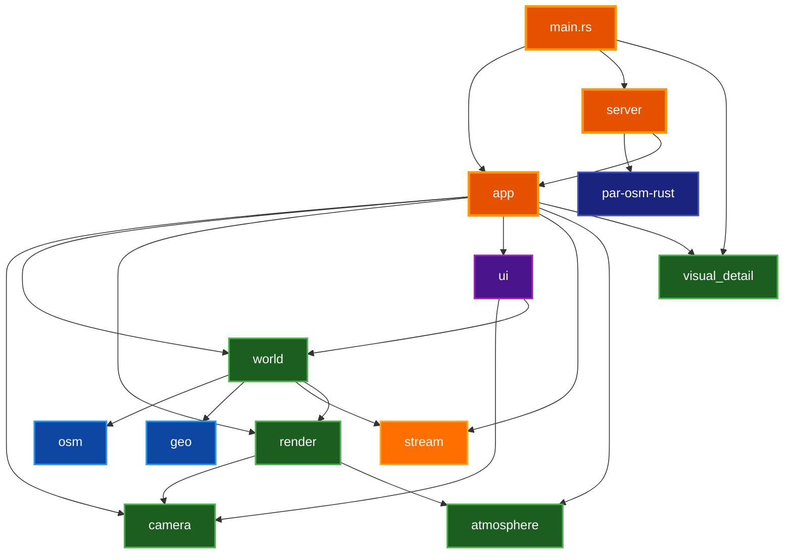
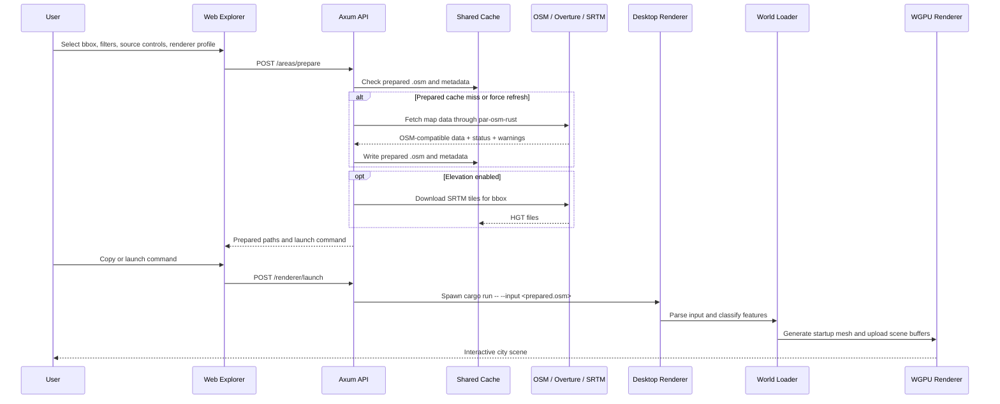

# Architecture

High-level architecture and design of `osm-world`, a Rust desktop renderer and local web application that turns OpenStreetMap, Overture, and SRTM data into an interactive WGPU city scene.

## Table of Contents

- [Overview](#overview)
- [High-Level Pipeline](#high-level-pipeline)
- [Runtime Modes](#runtime-modes)
- [Module Map](#module-map)
  - [Module Responsibilities](#module-responsibilities)
  - [Layer Dependencies](#layer-dependencies)
- [Coordinate System](#coordinate-system)
- [Data Flow](#data-flow)
- [Prepare-Area and Cache Architecture](#prepare-area-and-cache-architecture)
  - [API Endpoints](#api-endpoints)
  - [Prepare Request Flow](#prepare-request-flow)
  - [Renderer Launch Contract](#renderer-launch-contract)
- [Renderer Architecture](#renderer-architecture)
  - [Application State](#application-state)
  - [WGPU Initialization](#wgpu-initialization)
  - [Render Passes](#render-passes)
- [World Loading and Mesh Generation](#world-loading-and-mesh-generation)
  - [World Source Model](#world-source-model)
  - [Mesh Generation Order](#mesh-generation-order)
- [Streaming and LOD Model](#streaming-and-lod-model)
- [Web Explorer Architecture](#web-explorer-architecture)
- [Key Design Decisions](#key-design-decisions)
- [Known Risks and Boundaries](#known-risks-and-boundaries)
- [Related Documentation](#related-documentation)

## Overview

`osm-world` has two user-facing surfaces:

1. A WGPU desktop renderer that opens a native window and renders a city scene from local `.osm.pbf`, `.pbf`, or `.osm` data.
2. A local Axum API server plus Next.js Web Explorer that prepares map areas, manages cache history, and creates copyable renderer commands.

The renderer uses the shared `par-osm-rust` crate for source-data preparation and cache paths. The project keeps data acquisition, world classification, mesh generation, rendering, UI, and web orchestration separated so each layer can evolve independently.

## High-Level Pipeline

```mermaid
graph LR
    User[User]
    Web[Web Explorer]
    API[Axum API]
    Cache[(Shared par-osm-rust cache)]
    Source[OSM / Overture / SRTM sources]
    Parser[OSM parser]
    World[World feature classifier]
    Mesh[CPU mesh generator]
    GPU[WGPU buffers and render passes]
    Window[Desktop renderer]

    User --> Web
    Web --> API
    API --> Cache
    API --> Source
    Source --> Cache
    Cache --> Parser
    Parser --> World
    World --> Mesh
    Mesh --> GPU
    GPU --> Window
    User --> Window

    class User external
    class Web external
    class API primary
    class Cache database
    class Source data
    class Parser active
    class World active
    class Mesh active
    class GPU primary
    class Window external

    classDef primary fill:#e65100,stroke:#ff9800,stroke-width:3px,color:#ffffff
    classDef active fill:#1b5e20,stroke:#4caf50,stroke-width:2px,color:#ffffff
    classDef data fill:#0d47a1,stroke:#2196f3,stroke-width:2px,color:#ffffff
    classDef database fill:#1a237e,stroke:#3f51b5,stroke-width:2px,color:#ffffff
    classDef external fill:#4a148c,stroke:#9c27b0,stroke-width:2px,color:#ffffff
```



The Web Explorer is optional. The renderer can load a local input file directly, while the web workflow creates prepared `.osm` files in the shared cache and then launches or displays a renderer command.

## Runtime Modes

`src/main.rs` selects one of two runtime modes from CLI arguments.

| Mode | Entry Condition | Behavior |
| --- | --- | --- |
| Renderer | Default | Creates a Winit event loop, initializes `App`, loads optional input data, and opens the WGPU window. |
| API server | `--serve` | Starts a Tokio runtime and serves the Axum router on the configured host and port. |

Renderer mode receives `AppOptions`, including window size, screenshot settings, input paths, camera overrides, label flags, minimap flags, streaming options, and visual-detail settings.

## Module Map

The library crate exposes these top-level modules from `src/lib.rs`.

### Module Responsibilities

| Layer | Module | Responsibility |
| --- | --- | --- |
| Application | `app` | Winit application state, WGPU initialization, per-frame update, render-loop integration, user preferences, and area switching. |
| Environment | `atmosphere` | Day cycle, sun direction, light uniforms, and shadow-cascade blending inputs. |
| Camera | `camera` | Flycam state, input controller, projection/view matrices, spawn overrides, and shadow cascade math. |
| Data | `osm` | Local `.osm.pbf`, `.pbf`, and `.osm` parsing into nodes, ways, relations, tags, and bounds. |
| Geography | `geo` | Coordinate conversion, SRTM loading helpers, and elevation lookup. |
| World | `world` | Source loading, feature classification, terrain/road/building/water/landuse/railway/POI mesh generation, labels, addresses, and street signs. |
| Rendering | `render` | WGPU buffers, bind groups, city/sky/shadow/contact-shadow pipelines, minimap target, frustum helpers, occlusion queries, and vertex layout. |
| Streaming | `stream` | Tile coordinates, tile rectangles, tile debug states, and level-of-detail selection helpers. |
| UI | `ui` | Egui HUD, settings, labels, minimap, search, and feature inspection. |
| Server | `server` | Axum API for health, cache listing, prepared-area lifecycle, area preparation, and renderer launch. |
| Visual Detail | `visual_detail` | Renderer presets and knobs for landmarks, facade/roof variation, vegetation, bike/ped overlays, and reload-required state. |

### Layer Dependencies



## Coordinate System

The renderer uses world metres.

| Direction | World Axis | Sign |
| --- | --- | --- |
| East | X | +X |
| North | Z | -Z |
| Up | Y | +Y |

Geographic coordinates are projected with an equirectangular approximation. This is fast and works well for city-scale areas, but distortion grows with larger regions and higher latitudes.

Elevation comes from SRTM data when an SRTM directory is supplied or when the prepare workflow downloads the needed tiles. Without elevation data, terrain and features fall back to zero-height terrain where applicable.

## Data Flow



## Prepare-Area and Cache Architecture

The prepare API accepts a bbox, feature filter, elevation toggle, force-refresh flag, optional spawn coordinates, and source controls. It writes prepared `.osm` files and metadata under the shared `par-osm-rust` cache root.

### API Endpoints

| Method | Path | Purpose |
| --- | --- | --- |
| `GET` | `/health` | Return API status and shared cache directories. |
| `GET` | `/cache/areas` | List cached Overpass areas from `par-osm-rust`. |
| `GET` | `/areas/prepared` | List prepared renderer inputs. |
| `POST` | `/areas/prepared/{cache_key}` | Rename or favorite a prepared area. |
| `DELETE` | `/areas/prepared/{cache_key}` | Delete a prepared `.osm` file and metadata. |
| `POST` | `/areas/prepare` | Fetch or reuse source data, optionally download SRTM, and return renderer command data. |
| `POST` | `/renderer/launch` | Spawn the local renderer process for a prepared area. |

The router applies restricted Cross-Origin Resource Sharing (CORS) to `localhost:8032` and `127.0.0.1:8032`. Mutating endpoints require a Bearer token matching `OSM_WORLD_API_TOKEN` when that variable is set. Requests are rate-limited to 20 per minute per client IP.

### API Endpoint Schemas

#### `GET /health`

Returns the API health status.

**Response:** `200 OK`

```json
{
  "status": "ok"
}
```

#### `GET /cache/areas`

Lists cached Overpass areas from the shared `par-osm-rust` cache.

**Response:** `200 OK`

```json
[
  {
    "key": "<64-char-hex-cache-key>",
    "bbox": [38.0, -121.0, 38.001, -120.999],
    "created_at": "2026-05-09T12:00:00Z",
    "size_bytes": 12345
  }
]
```

#### `GET /areas/prepared`

Lists all prepared renderer input areas, sorted by favorite, display name, and cache key.

**Response:** `200 OK` -- Array of `PreparedAreaEntry` objects (see `POST /areas/prepare` response for shared fields).

```json
[
  {
    "cache_key": "<64-char-hex>",
    "display_name": "Downtown Sacramento",
    "favorite": true,
    "bbox": [38.568, -121.505, 38.592, -121.475],
    "filter": { "roads": true, "buildings": true, "water": true, "landuse": true, "railways": true },
    "use_elevation": false,
    "overture": false,
    "overture_themes": [],
    "poi_source_mode": null,
    "overture_failure_mode": null,
    "overture_timeout": null,
    "source_status": "osm_only",
    "warnings": [],
    "osm_path": "/home/user/.cache/par-osm-rust/prepared/<key>.osm",
    "srtm_dir": null,
    "spawn_lat": 38.5816,
    "spawn_lon": -121.4944,
    "command": "cargo run --manifest-path ... -- --input ...",
    "command_cwd": "/path/to/osm-world",
    "command_program": "cargo",
    "command_args": ["run", "--manifest-path", "...", "--", "--input", "..."]
  }
]
```

#### `POST /areas/prepare`

Fetches or reuses source data, optionally downloads SRTM tiles, and returns a renderer command.

**Authentication:** Required when `OSM_WORLD_API_TOKEN` is set.

**Request Body:**

```json
{
  "bbox": [38.568, -121.505, 38.592, -121.475],
  "filter": { "roads": true, "buildings": true, "water": true, "landuse": true, "railways": true },
  "use_elevation": false,
  "force_refresh": false,
  "overpass_url": "https://overpass-api.de/api/interpreter",
  "spawn_lat": 38.5816,
  "spawn_lon": -121.4944,
  "overture": false,
  "overture_themes": ["address", "base", "building", "place", "transportation"],
  "poi_source_mode": "osm_only",
  "overture_failure_mode": "fallback_to_osm",
  "overture_timeout": 120
}
```

| Field | Type | Required | Default | Description |
| --- | --- | --- | --- | --- |
| `bbox` | `[f64; 4]` | Yes | -- | `[south, west, north, east]` in degrees. Max span 0.5 degrees, max area 0.1 sq degrees. |
| `filter` | `FeatureFilter` | No | All true | Toggle which OSM feature types to include. |
| `use_elevation` | `bool` | No | `false` | Download SRTM elevation tiles. Max 16 tiles per request. |
| `force_refresh` | `bool` | No | `false` | Re-fetch source data even if a prepared file exists. |
| `overpass_url` | `string` | No | Default Overpass URL | Override the Overpass endpoint. Must be HTTPS. |
| `spawn_lat`, `spawn_lon` | `f64` | No | `null` | Camera spawn coordinates. Must be inside bbox if provided. |
| `overture` | `bool` | No | `false` | Enable Overture Maps data. |
| `overture_themes` | `string[]` | No | All themes | Overture theme names to include. |
| `poi_source_mode` | `PoiSourceMode` | No | `overture_preferred` | POI source selection strategy. |
| `overture_failure_mode` | `OvertureFailureMode` | No | `fallback_to_osm` | Behavior when Overture fetch fails. |
| `overture_timeout` | `u64` | No | `120` | Overture request timeout in seconds. |

**Success Response:** `200 OK`

```json
{
  "bbox": [38.568, -121.505, 38.592, -121.475],
  "cache_key": "<64-char-hex>",
  "cache_status": "prepared",
  "source_status": "osm_only",
  "warnings": [],
  "osm_path": "/home/user/.cache/par-osm-rust/prepared/<key>.osm",
  "srtm_dir": null,
  "spawn_lat": 38.5816,
  "spawn_lon": -121.4944,
  "command": "cargo run --manifest-path '/path/Cargo.toml' -- --input '/cache/<key>.osm' --spawn-lat 38.5816 --spawn-lon -121.4944",
  "command_cwd": "/path/to/osm-world",
  "command_program": "cargo",
  "command_args": ["run", "--manifest-path", "...", "--", "--input", "...", "--spawn-lat", "38.5816", "--spawn-lon", "-121.4944"]
}
```

`cache_status` has three values:

| Value | Meaning |
| --- | --- |
| `prepared_cache_hit` | A prepared `.osm` file already existed on disk and was reused without re-fetching source data. |
| `prepared` | No prepared file existed, so source data was fetched and a new `.osm` file was written. |
| `force_refreshed` | `force_refresh` was `true`, so source data was re-fetched and the prepared `.osm` file was overwritten even if it existed. |

**Error Responses:**

| Status | Cause | Example |
| --- | --- | --- |
| `400 Bad Request` | Invalid bbox, spawn, filter, or Overpass URL | `{"error": "invalid request"}` |
| `401 Unauthorized` | Missing or incorrect Bearer token | `{"error": "unauthorized"}` |
| `429 Too Many Requests` | Rate limit exceeded | `{"error": "rate limit exceeded"}` |
| `502 Bad Gateway` | Upstream Overpass or Overture failure | `{"error": "failed to fetch map data"}` |
| `500 Internal Server Error` | Filesystem or serialization failure | `{"error": "failed to prepare area"}` |

#### `POST /areas/prepared/{cache_key}`

Updates the display name or favorite flag of a prepared area.

**Authentication:** Required when `OSM_WORLD_API_TOKEN` is set.

**Request Body:**

```json
{
  "display_name": "Downtown Sacramento",
  "favorite": true
}
```

**Success Response:** `200 OK` -- Updated `PreparedAreaEntry` (see `GET /areas/prepared`).

**Error Responses:** `400 Bad Request`, `401 Unauthorized`, `500 Internal Server Error`.

#### `DELETE /areas/prepared/{cache_key}`

Deletes a prepared `.osm` file and its `.meta.json` sidecar.

**Authentication:** Required when `OSM_WORLD_API_TOKEN` is set.

**Success Response:** `200 OK`

```json
{
  "status": "deleted",
  "cache_key": "<64-char-hex>"
}
```

**Error Responses:** `400 Bad Request`, `401 Unauthorized`, `500 Internal Server Error`.

#### `POST /renderer/launch`

Spawns the local renderer process for a prepared area.

**Authentication:** Required when `OSM_WORLD_API_TOKEN` is set.

**Request Body:**

```json
{
  "osm_path": "/home/user/.cache/par-osm-rust/prepared/<key>.osm",
  "srtm_dir": "/home/user/.cache/par-osm-rust/srtm",
  "spawn_lat": 38.5816,
  "spawn_lon": -121.4944,
  "extra_args": ["--visual-preset", "showcase", "--time-of-day", "16.5"]
}
```

| Field | Type | Required | Description |
| --- | --- | --- | --- |
| `osm_path` | `string` | Yes | Path to a prepared `.osm` file. |
| `srtm_dir` | `string` | No | SRTM cache directory. |
| `spawn_lat`, `spawn_lon` | `f64` | No | Camera spawn coordinates. |
| `extra_args` | `string[]` | No | Additional renderer flags. Validated against an allowlist. |

**Success Response:** `200 OK`

```json
{
  "status": "launched"
}
```

**Error Responses:** `400 Bad Request` (invalid args or path), `401 Unauthorized`, `500 Internal Server Error`.

### Prepare Request Flow

1. Validate the bbox, spawn coordinates, feature filter, and Overpass URL.
2. Resolve effective source controls. Overture controls are ignored when Overture is disabled.
3. Compute a prepared cache key from bbox, filter, Overture/source settings, and effective Overpass URL.
4. Reuse the prepared `.osm` file when it exists and `force_refresh` is false.
5. On a miss, call `par_osm_rust::sources::fetch_map_data()` and write the returned OSM-compatible XML atomically.
6. If elevation is enabled, validate the SRTM tile limit and download missing tiles.
7. Write prepared metadata, including source status, warnings, display name, favorite flag, bbox, filter, source settings, SRTM path, and spawn point.
8. Return the prepared paths plus a renderer launch command.

### Renderer Launch Contract

The server builds a command shaped like this:

```bash
cargo run --manifest-path <project-root>/Cargo.toml -- --input <prepared.osm>
```

When present, the server appends `--spawn-lat`, `--spawn-lon`, and `--srtm-dir`. `/renderer/launch` also accepts `extra_args`, which the Web Explorer uses to forward selected renderer-profile flags such as visual presets, time of day, streaming budgets, label settings, and minimap settings. The copyable command variants add release, screenshot, and no-streaming forms client-side.

## Renderer Architecture

### Application State

`AppOptions` carries startup configuration into the renderer:

- window size;
- screenshot path, screenshot delay, and auto-exit delay;
- input and SRTM paths;
- camera and spawn overrides;
- settings-panel, label, minimap, and shadow-debug flags;
- streaming options;
- visual-detail settings.

`App` stores mutable runtime state, including the camera controller, performance state, minimap settings, label settings, search state, inspection state, area-switch state, and visual-detail settings.

### WGPU Initialization

`app::init::init_wgpu()` initializes:

- Winit window and WGPU surface;
- GPU adapter, device, queue, surface configuration, and depth buffer;
- egui renderer state;
- fly camera and optional persisted/spawn camera placement;
- scene bind group and light/shadow bind groups;
- city, sky, shadow, and contact-shadow pipelines;
- occlusion query resources;
- minimap render target.

When an input path is provided, initialization loads the world source, derives labels/search/inspection/tile-debug data, generates the CPU mesh, validates GPU buffer sizes against device limits, and uploads it into `SceneBuffers`. With streaming enabled, startup generation selects nearby tiles around the effective camera position and rebuilds with fewer tiles if the mesh would exceed the GPU buffer budget.

### Render Passes

The render loop updates camera, lighting, and visual-detail uniforms, then renders in this order:

1. Shadow cascades for shadow-casting geometry.
2. Main scene to the contact-shadow color target:
   - sky;
   - terrain;
   - land use and land-use overlays;
   - water;
   - road paths, roads, railways, and road markings;
   - solid geometry such as buildings, landmarks, signs, and vegetation.
3. Optional minimap scene pass using the same geometry classes.
4. Contact-shadow composite pass to the swapchain image.
5. egui HUD and settings panels.
6. Optional screenshot copy and save.

`SceneBuffers` splits the index data into render-layer-specific buffers so overlays can draw in a deterministic order without relying on source iteration order alone.

## World Loading and Mesh Generation

### World Source Model

`WorldSource` is the CPU-side scene model. It stores:

- geographic bounds and coordinate converter;
- optional elevation data;
- buildings;
- roads;
- railways;
- transit routes;
- closed water polygons;
- open waterway ribbons;
- land uses;
- point features;
- address points;
- resolved street signs.

The loader parses local OSM input, builds a coordinate converter, resolves elevation per feature, classifies OSM tags, and prepares render-friendly feature lists.

### Mesh Generation Order

The current full-scene mesh generator appends geometry in a deliberate order:

1. terrain with tunnel portal cuts;
2. land-use polygons;
3. closed water polygons and uncovered open waterway ribbons;
4. roads, road markings, road caps, bridges, tunnels, and related structures;
5. transit route overlays;
6. railway tracks;
7. point features and landmarks;
8. street signs;
9. buildings with deterministic facade and roof variation.

The generated mesh uses `render::vertex::Vertex`, which carries position, normal, color, UV, and feature type. Feature type drives render-layer splitting and shadow-caster selection.

## Streaming and LOD Model

The `stream` module defines tile and level-of-detail primitives:

| Concept | Current Role |
| --- | --- |
| `TileCoord` | Converts world X/Z coordinates to tile coordinates and tile rectangles. |
| `TileDebugState` | Tracks queued, generating, uploaded, visible, culled, evicted, and failed states for UI/debug overlays. |
| `TileFeatureRefs` | Stores feature indices assigned to a tile, including closed water polygons and open waterways. |
| `LodConfig` | Selects `Near`, `Mid`, or `Far` with hysteresis to prevent threshold flicker. |
| `TileLod` | Controls terrain spacing for tile mesh generation helpers. |

> **Note:** The current renderer uses the streaming primitives to build a capped startup mesh around the effective camera position. It still uploads that result as one `SceneBuffers` allocation; the streaming module remains the boundary for future incremental runtime tile uploads.

Default LOD behavior uses three tiers:

| LOD | Role | Terrain Spacing |
| --- | --- | --- |
| `Near` | Close camera detail | 10 metres |
| `Mid` | Intermediate detail | 50 metres |
| `Far` | Distant detail | 100 metres |

## Web Explorer Architecture

The web app lives in `web/` and uses Next.js, React, and OpenLayers.

| File or Area | Responsibility |
| --- | --- |
| `web/src/app/page.tsx` | Main client-side workflow: health/cache load, bbox selection, source controls, prepare request, history, command variants, and launch UI. |
| `web/src/components/MapPicker.tsx` | OpenLayers map, bbox drawing, cache overlays, and spawn-point interactions. |
| `web/src/lib/api.ts` | Typed client for the Rust API endpoints. |
| `web/src/lib/settingsProfiles.ts` | Renderer profile import/export and defaults. |
| `web/src/lib/commandVariants.ts` | Debug, release, screenshot, and no-streaming command generation. |
| `web/src/lib/bboxPresets.ts` | Predefined bbox shortcuts. |
| `web/src/lib/errorHints.ts` | User-facing hints for common prepare or launch errors. |

The frontend reads `NEXT_PUBLIC_OSM_WORLD_API_URL` and defaults to `http://127.0.0.1:3030`.

## Key Design Decisions

| Decision | Rationale | Cost |
| --- | --- | --- |
| **Rust + WGPU renderer** | Provides native performance, explicit GPU resource control, and cross-platform rendering. | Requires GPU-capable development and platform-specific graphics debugging. |
| **Local Axum API for Web Explorer** | Keeps browser UI simple while letting Rust own filesystem, cache, and process-launch work. | The web UI depends on a local server and CORS boundary during development. |
| **Shared `par-osm-rust` cache crate** | Reuses Overpass, Overture, SRTM, source, parse, and cache behavior with related projects. | Requires a sibling checkout until the dependency is published or vendored. |
| **Prepared `.osm` files** | Gives the renderer a deterministic local input and makes command variants copyable. | Prepared files can become stale if source settings change without a refresh. |
| **Equirectangular projection** | Fast and adequate for city-scale scenes. | Not suitable for very large regions or high-precision geodesic analysis. |
| **Layer-specific index buffers** | Makes draw ordering and shadow inclusion explicit without duplicating vertices. | Adds CPU-side index partitioning when scene buffers are built. |
| **Capped startup mesh with streaming boundaries** | Avoids oversized startup GPU buffers while keeping tile, LOD, and debug abstractions reusable. | Runtime movement still uses one uploaded `SceneBuffers` allocation until incremental tile upload is completed. |

## Known Risks and Boundaries

- **Input size:** Large prepared regions still create large CPU meshes during startup selection, and runtime rendering still uses one uploaded scene buffer allocation.
- **Source availability:** Overpass, Overture, and SRTM workflows depend on network availability unless data already exists in cache.
- **Local launch trust boundary:** `/renderer/launch` spawns a local process. Keep the API bound to a trusted local interface unless you intentionally harden it for remote use.
- **Projection accuracy:** The coordinate system is optimized for city-scale visualization, not surveying or continental-scale rendering.
- **Documentation drift:** Historical specs in `docs/superpowers/` describe design intent at the time they were written. Prefer current source and this architecture document for present behavior.

## Related Documentation

- [README.md](../README.md) — User-facing overview, installation, quick start, Web Explorer workflow, and contribution checks
- [Initial 3D Engine Design](superpowers/specs/2026-05-01-osm-world-3d-engine-design.md) — Original renderer module layout, coordinate system, and mesh-generation algorithms
- [Streaming and LOD Design](superpowers/specs/2026-05-02-phase3-streaming-lod-design.md) — Planned tile streaming, level-of-detail, and runtime loading direction
- [Shared Cache and Web Picker Design](superpowers/specs/2026-05-03-shared-osm-cache-and-streaming-design.md) — Shared `par-osm-rust` cache contract and prepare workflow
- [Visual Detail Controls Design](superpowers/specs/2026-05-06-osm-world-visual-detail-controls-design.md) — Visual presets, landmarks, facade variation, vegetation, and screenshot validation
